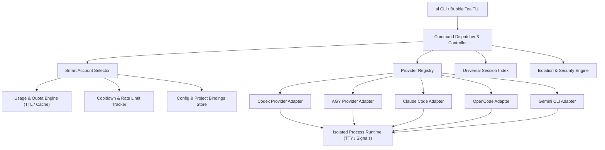
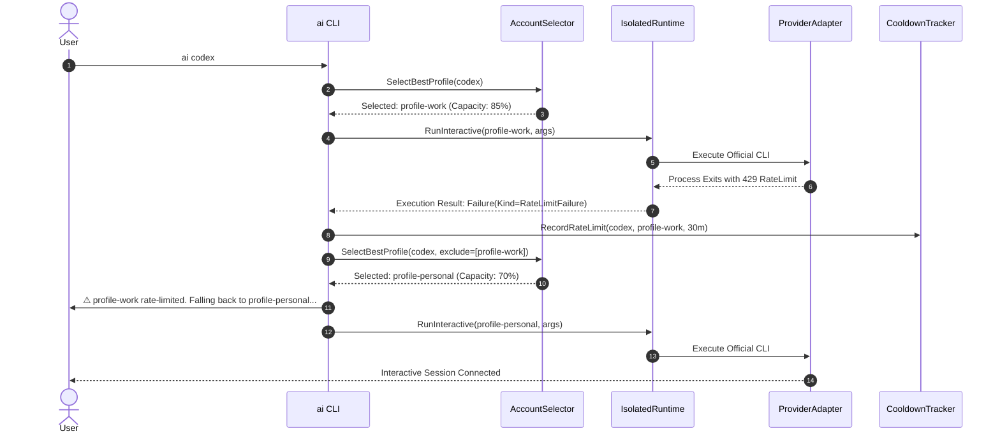

# Architecture: AI CLI Control Plane

```text
                               ai CLI / TUI
                                    │
                         Provider Registry & Dispatcher
                                    │
        ┌──────────────┬────────────┼────────────┬──────────────┐
        │              │            │            │              │
      Codex           AGY         Claude      OpenCode        Gemini
     Adapter        Adapter      Adapter      Adapter        Adapter
        │              │            │            │              │
    CODEX_HOME    profile HOME   CLAUDE_HOME  OPENCODE_HOME  GEMINI_HOME
   per profile   XDG per profile per profile  per profile    per profile
        │        D-Bus keyring      │            │              │
        │              │            │            │              │
  official codex  official agy official claude official opencode official gemini
        │              │            │            │              │
        └──────────────┴────────────┼────────────┴──────────────┘
                                    │
                            current directory
                           same Linux UID/GID
```

---

## 1. Core Principles

- **No Central OAuth Proxy**: Authentication and refresh tokens are owned by official CLIs. `ai-cli` manages process isolation, environment variables, and credential storage paths.
- **Honest Quota Engine**: Never presents missing data as 100%. Quotas explicitly report `LIVE`, `CACHED`, `UNKNOWN`, `RATE_LIMITED`, or `UNSUPPORTED`.
- **Smart Account Selection**: Scores candidate accounts based on capacity, health, project bindings, and priorities.
- **Automatic Fallback**: Recovers from 429 rate limits by switching to the next best account seamlessly.

---

## 2. Component Diagram



---

## 3. Run & Fallback Sequence



---

## 4. Provider Capabilities Matrix

| Provider | Profiles | Isolation | Usage | Resume Syntax | Cross-Account Resume | Auto Selection |
|---|---|---|---|---|---|---|
| **Codex** | Unlimited | `CODEX_HOME` | `LIVE` / `CACHED` | `codex resume <id>` | Yes (shared sessions) | Yes |
| **AGY** | Unlimited | D-Bus Keyring + `HOME` | `LIVE` / `CACHED` | `agy --conversation=<id>` | Yes (shared brain) | Yes |
| **Claude Code** | Unlimited | `CLAUDE_CONFIG_DIR` + `HOME` | `LIVE` / `UNKNOWN` | `claude --resume <id>` | No | Yes |
| **OpenCode** | Unlimited | `OPENCODE_CONFIG_DIR` + `XDG` | `LIVE` / `UNKNOWN` | `opencode -s <id>` | Yes | Yes |
| **Gemini CLI** | Unlimited | `GEMINI_CLI_HOME` + `HOME` | `LIVE` / `UNKNOWN` | `gemini -r <id>` | No | Yes |

---

## 5. AI Control Plane Architecture

The AI Control Plane introduces a supervised runtime model where AI developer tools execute inside a managed host wrapper. This wrapper provides cross-provider interoperability, resilient handoffs, and capability discovery.

### Core Concepts

- **Session Host (`internal/control/host`)**: The background daemon wrapper for a single provider process. It manages a persistent Unix Domain Socket (or Windows Named Pipe) for RPC commands and interactive terminal data streaming.
- **Control Drivers (`internal/control/driver`)**: Provider-specific adapters that declare runtime capabilities (e.g., `Process`, `Terminal`, `Sessions`, `Resume`, `SlashControl`) and construct exact execution binaries and environments.
- **Session Registry (`internal/control/registry`)**: A unified, cross-process persistent registry tracking all active runtime sessions, PIDs, host PIDs, and active states (`STARTING`, `RUNNING`, `STOPPED`, `HANDOFF`).
- **Handoff Engine (`internal/control/handoff`)**: Orchestrates safe state transitions, capturing bounded `WorkCheckpoints` (git branches, diff stats, goal) and persisting `LineageRecords` to safely move work between profiles or providers.

### Inter-Process Control Flow

1. The `ai control start` command provisions a new `registry.RuntimeSession`, spawns `ai __control-host` in the background, and immediately attaches to the new socket.
2. The background `SessionHost` runs the actual provider CLI (via PTY) and broadcasts stdout to all attached clients via a ring buffer.
3. Attached user terminals send input which the `SessionHost` intercepts using a `SlashRouter`.
4. Commands like `/ai handoff` trigger asynchronous transactional handoff routines that quiesce the current process, launch the target process, and safely link session IDs before stopping the source process.
