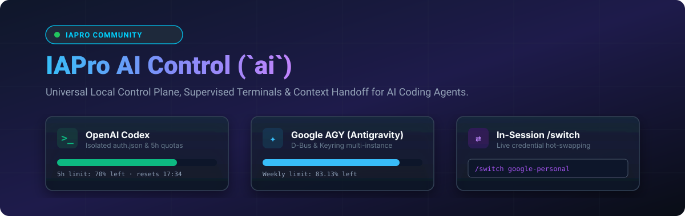
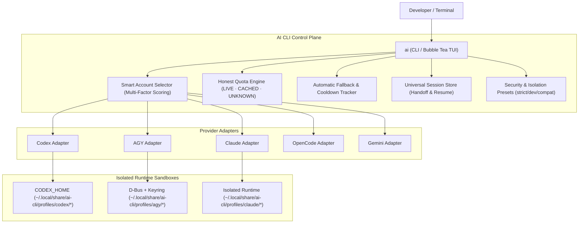

<p align="center">
  
</p>

<p align="center">
  <a href="https://golang.org"></a>
  <a href="LICENSE"></a>
  <a href="https://kernel.org"></a>
  
</p>

<p align="center">
  <a href="README.md">🇧🇷 Português (Brasil)</a> &nbsp;|&nbsp; <strong>🇬🇧 English</strong>
</p>

<h3 align="center">
  ⚡ Intelligent Local Control Plane, Credential Isolation &amp; Quota Supervisor for AI Coding CLIs
</h3>

---

**AI CLI (`ai`)** is a high-performance local **Control Plane** built in Go for developers and teams using multiple AI coding assistants in their terminal (including **OpenAI Codex**, **Google AGY / Antigravity**, **Anthropic Claude Code**, **OpenCode**, and **Google Gemini CLI**).

It securely manages multiple account identities, isolates authentication credentials in dedicated per-profile sandboxes, tracks honest usage quotas without fabricated data, automatically selects the optimal account for each execution via multi-factor scoring, and seamlessly resumes conversations across accounts without rate-limit disruptions (429).

---

## 📸 Interactive Terminal User Interface (TUI)

Launch the interactive control plane at any time by running `ai`:

```text
 ┌────────────────────────────────────────────────────────────────────────────────────────┐
 │  AI CLI Control Plane v0.4.0                             Workspace: ~/tools/ai-manager │
 ├─────────────────────────┬──────────────────────────────────────────────────────────────┤
 │ Providers               │ Accounts (Codex)                                             │
 │                         │                                                              │
 │ ▸ ● Codex             2 │ ▸ ● [1] openai-work          ChatGPT Plus  [███████░░░] 70% ★│
 │   ● AGY               2 │   ● [2] openai-personal      ChatGPT Plus  [██████████] 100% │
 │   ○ Claude            0 │                                                              │
 │   ○ OpenCode          0 │                                                              │
 │   ○ Gemini            0 │                                                              │
 ├─────────────────────────┴──────────────────────────────────────────────────────────────┤
 │ Recent Sessions (Universal Index)                                                      │
 │                                                                                        │
 │ ▸ [1] 12m ago    # REFACTOR CONTROL PLANE                 [AGY   ]  ~/tools/ai-manager │
 │   [2] yesterday  Verify types and linting                [CODEX ]  ~/tools/ai-manager   │
 │   [3] 2 days ago Fix concurrency edge cases              [CODEX ]  ~/tools/ai-manager   │
 │   [4] 3 days ago Security audit                          [AGY   ]  ~/projects          │
 ├────────────────────────────────────────────────────────────────────────────────────────┤
 │ Selected: Codex / openai-work  [Authenticated]                                         │
 │ Actions:  [Enter/1-9] Run  [c] Continue Latest  [r] Resume Modal  [s] Quotas  [l] Login│
 │ AUTO: openai-personal (100% capacity) is optimal for new sessions                     │
 ├────────────────────────────────────────────────────────────────────────────────────────┤
 │ [↑/↓] Navigate  [←/→/Tab] Switch Box  [1-9] Quick Launch  [/] Search  [q/Esc] Quit     │
 └────────────────────────────────────────────────────────────────────────────────────────┘
```

---

## 🌟 Key Features

### 1. 🛡️ Multi-Account Sandboxing & Credential Isolation
- **Strictly Isolated State:** Each profile maintains its own isolated `HOME`, `XDG_DATA_HOME`, `XDG_CONFIG_HOME`, private D-Bus session, and dedicated `gnome-keyring-daemon` vault.
- **Zero Token Collisions:** Google OAuth tokens, OpenAI, Anthropic, and custom API keys are restricted to secure per-profile directories with strict `0600` permissions.
- **Configurable Isolation Presets:** Choose between `developer` (preserves git context and dotfiles), `strict` (hermetic sandbox), and `compat`.
- **Preserves Workspace Context:** Your working directory (`CWD`), user UID/GID, shell configurations, and git repositories remain fully preserved.

### 2. 🧠 Smart Account Selector
The scheduler evaluates multiple live factors to pick the optimal profile for each run:
- **Multi-Factor Scoring:** Considers remaining quota capacity, workspace bindings, default preferences, user priorities, and Pro tiers.
- **Full Transparency (`ai explain <provider>`):** Inspect the exact score breakdown:
  ```bash
  $ ai explain agy
  === Smart Account Selection Explanation: AGY ===
  Evaluation of all candidate profiles:

  Optimal Choice: google-work (Reason: authenticated, 92% capacity (+73.9), default profile (+25.0), pro tier (+15.0))

  PROFILE            ELIGIBLE   SCORE    BREAKDOWN / REJECTION
  google-work        YES        213.9    authenticated, 92% capacity (+73.9), default profile (+25.0), pro tier (+15.0)
  google-personal    YES        195.0    authenticated, 100% capacity (+80.0), pro tier (+15.0)
  ```

### 3. ⚡ Automatic Fallback & Cooldown Tracker
- **Cycle-Safe Recovery:** When a profile hits HTTP 429 or runs out of credits during execution, AI CLI detects the failure, records cooldown, and seamlessly retries with the next best account.
- **Loop Prevention:** Each profile is tested at most once per execution cycle.

### 4. 📊 Honest & Real Quota Engine (`ai usage`)
- **No Fabricated Quotas:** Eliminates fake 100% assumptions. Accurately reports `LIVE` (API/CLI probed), `CACHED` (valid local state), `RATE_LIMITED`, or `UNKNOWN`.
- **5-Hour and Weekly Windows:** Real-time visibility into quota reset timelines.

```bash
$ ai usage
```
```text
PROVIDER   PROFILE          ACCOUNT                  PLAN             CAPACITY / 5H                STATUS
agy        google-work      work@company.com         Google AI Pro    [█████████░] 92%             CACHED
agy        google-personal  dev@gmail.com            Google AI Pro    [██████████] 100%            CACHED
codex      openai-work      work@company.com         ChatGPT Plus     [███████░░░] 70%             CACHED
codex      openai-personal  dev@gmail.com            ChatGPT Plus     [██████████] 100%            CACHED
```

### 5. 🔄 Universal Session Handoff & Resume
- **Cross-Provider Index:** Instantly discover and filter conversations across all providers (`ai sessions` or `/` in TUI).
- **Cross-Account Resumption:** Continue any past conversation using a different account that has available quota:
  ```bash
  ai resume <session-id> [provider:profile]
  ```
- **Interactive Resume Modal:** Press `[r]` or `[Enter]` on any recent session in the TUI to choose a profile with auto-recommendations.

### 6. 📁 Workspace & Project Bindings
Pin repository directories to dedicated profiles (e.g. work vs. personal):
```bash
# Bind current workspace to work profile
ai bind codex:openai-work

# List all discovered workspaces
ai workspaces
```

### 7. 🔌 5 Natively Supported Providers

AI CLI Control Plane natively coordinates leading terminal AI coding assistants:

#### 🟢 OpenAI Codex (`codex`)
- **Execution:** `ai codex` (smart selection) or `ai codex:openai-work --model gpt-5.6-sol`
- **Isolation:** Dedicated per-profile `CODEX_HOME` environment with `auth.json` and `config.toml` in restricted mode (`0600`).
- **Quotas:** 5-Hour and Weekly limits matching official Codex status metrics (`/status`, `/usage`).
- **Resumption:** Provider-native session continuation (`codex resume <session-id>`).

#### 🔵 Google AGY / Antigravity (`agy`)
- **Execution:** `ai agy` (smart selection) or `ai agy:google-work -c`
- **Isolation:** Private sandboxed D-Bus session (`dbus-run-session`) with dedicated `gnome-keyring-daemon` and isolated `antigravity-oauth-token`.
- **Quotas:** Google AI Pro 5-Hour and Weekly limits (Gemini 2.5 Pro / Claude 3.7 Sonnet).
- **Resumption:** Native conversation dispatch (`agy --conversation=<session-id>`).

#### 🟣 Anthropic Claude Code (`claude`)
- **Execution:** `ai claude` (smart selection) or `ai claude:claude-work -p "refactor auth"`
- **Isolation:** Dedicated per-profile `CLAUDE_CONFIG_DIR` with isolated OAuth credentials and API keys.
- **Resumption:** Native session continuation (`claude --resume <session-id>`).

#### 🟠 OpenCode (`opencode`)
- **Execution:** `ai opencode` or `ai opencode:local --model ollama/deepseek-r1`
- **Isolation:** Independent per-profile `OPENCODE_HOME` and `XDG_DATA_HOME`.
- **Capabilities:** Multi-model support for local LLMs (Ollama, vLLM) and cloud providers.
- **Resumption:** Native session resumption (`opencode session <id>`).

#### 💎 Google Gemini CLI (`gemini`)
- **Execution:** `ai gemini` (smart selection) or `ai gemini:personal`
- **Isolation:** Dedicated `GEMINI_CLI_HOME` with isolated `google_accounts.json` per profile.
- **Capabilities:** Google OAuth authentication without multi-account collisions.

---

### 8. ⚡ AI Control — Supervised Runtimes & Universal Slash Channel (`/ai`)

AI CLI provides two complementary operational modes:
- **Classic Mode (`ai <provider>`)**: Fast, direct CLI execution with multi-factor account selection and anti-rate-limit fallback.
- **Supervised Mode (`ai control start <provider>`)**: Execution under `SessionHost` with interactive reattach (Attach/Detach), real-time event bus, and in-session universal slash commands.

#### 🎮 Universal Slash Commands (Inside the Supervised Terminal)
When running inside a supervised session, type special commands starting with `/ai` directly into the CLI prompt. AI Control intercepts them locally without sending them to the model:

| Command | Description |
| :--- | :--- |
| `/ai status` | Displays active runtime status, PID, session ID, and quota capacity. |
| `/ai accounts` | Lists all configured accounts for the provider and remaining limits. |
| `/ai usage` | Displays live usage metrics and reset windows. |
| `/ai handoff <profile>` | **Account Handoff:** Transitions active work to another profile of the same provider. |
| `/ai continue <provider>` | **Context Handoff:** Starts a new session on another provider with workspace tasks and diffs. |
| `/ai detach` | Detaches from interactive terminal while keeping the agent process alive. |
| `/ai stop` | Sends graceful termination signal to the assistant. |
| `//ai <text>` | **Escape Prefix:** Sends literal `/ai` text directly to the assistant. |

#### 🖥️ Control Center CLI Commands (`ai control` / `ai ui`)
```bash
ai control                                      # Opens interactive Bubble Tea Control Center
ai control start codex [--profile work]         # Starts a supervised runtime session
ai control running [--json]                     # Lists active supervised runtimes
ai control status <runtime-id> [--json]         # Inspects details of a runtime
ai control attach <runtime-id>                  # Reconnects terminal to an active session
ai control stop <runtime-id>                    # Stops a supervised runtime
ai control handoff <id> codex:personal          # Performs account handoff preserving session
ai control continue <id> --with claude:work     # Transfers work context to another provider
ai control cleanup                              # Removes orphaned records and dead sockets
ai control doctor [--json]                      # Audits drivers, sockets, and compatibility
```

---

## 🚀 Installation & Quick Start

### 1-Line Quick Install (Zero-Clone / Recommended)

**Linux & macOS (via `curl | bash`):**
```bash
curl -fsSL https://raw.githubusercontent.com/kivervinicius/ai-cli/main/install.sh | bash
```

**Windows & PowerShell Core (via `irm | iex`):**
```powershell
irm https://raw.githubusercontent.com/kivervinicius/ai-cli/main/install.ps1 | iex
```

**Via `go install` (any system with Go):**
```bash
go install github.com/kivervinicius/ai-cli/cmd/ai@latest
```

---

### Install from Source (Optional)

**Linux / macOS:**
```bash
git clone https://github.com/kivervinicius/ai-cli.git
cd ai-cli
make install
```

**Windows / PowerShell:**
```powershell
git clone https://github.com/kivervinicius/ai-cli.git
cd ai-cli
.\install.ps1
```

---

## 🐚 Shell Completion (Bash, Zsh, Fish, and PowerShell)

Enable full tab completion for providers, profiles, sessions, and flags:

### Bash
```bash
source <(ai completion bash)
# Persist in ~/.bashrc:
echo 'source <(ai completion bash)' >> ~/.bashrc
```

### Zsh
```zsh
source <(ai completion zsh)
# Persist in ~/.zshrc:
echo 'source <(ai completion zsh)' >> ~/.zshrc
```

### Fish
```fish
ai completion fish | source
```

### PowerShell (Windows & pwsh)
```powershell
ai completion powershell | Out-String | Invoke-Expression

# Persist in your $PROFILE:
Add-Content $PROFILE "`nai completion powershell | Out-String | Invoke-Expression"
```

---

## 💻 CLI Command Reference

### Interactive TUI & Execution
| Command | Description |
| :--- | :--- |
| `ai` | Launches the interactive Bubble Tea control plane TUI (Classic Mode). |
| `ai control` / `ai ui` | Opens the interactive AI Control Center TUI for supervised runtimes. |
| `ai control start <provider>` | Launches a persistent background runtime with universal `/ai` slash command control. |
| `ai control running` | Lists active managed runtimes across all providers. |
| `ai control attach <id>` | Connects the interactive terminal to a running background session. |
| `ai control stop <id>` | Gracefully stops a supervised runtime. |
| `ai control handoff <id> <profile>` | Performs transactional same-provider account handoff with session continuity. |
| `ai control continue <id> --with <prov>` | Executes cross-provider context handoff with automated secret redaction. |
| `ai control doctor` | Audits control runtime environment, IPC transport, and truthful provider capabilities. |
| `ai <provider> [args...]` | Runs the provider with automatic smart account selection (e.g. `ai codex -m gpt-5`). |
| `ai <provider>:<profile> [args...]` | Directly runs with the specified profile (e.g. `ai agy:work -c`). |
| `ai explain <provider>` | Explains why the Smart Account Selector chose a specific account. |

### Supervised In-Session Slash Commands (`/ai`)
| Slash Command | Description |
| :--- | :--- |
| `/ai status` | Displays live runtime identifiers, state, and honest quota metrics. |
| `/ai accounts` | Lists configured accounts, auth status, and remaining capacity for active provider. |
| `/ai usage` | Shows point-in-time quota metrics and reset windows. |
| `/ai handoff <profile>` | Initiates transactional account transition on the same provider. |
| `/ai continue <provider>` | Creates a safe, bounded work checkpoint and transfers context to another provider. |
| `/ai detach` | Detaches the terminal while keeping the background agent process running. |
| `/ai stop` | Gracefully terminates the supervised session. |
| `//ai <text>` | Escape prefix to send literal `/ai` commands directly to the model. |

### Profile & Authentication Management
| Command | Description |
| :--- | :--- |
| `ai profiles` / `ai list` | Lists all configured profiles, accounts, plans, and statuses. |
| `ai add <provider> <name>` | Creates a new isolated profile and initializes its sandbox. |
| `ai login <provider> <name>` | Triggers official CLI authentication for the profile. |
| `ai logout <provider> <name>` | Removes credentials from the profile. |
| `ai use <provider> <name>` | Sets the default profile for a provider. |
| `ai rename <provider> <old> <new>` | Renames a profile while preserving session history. |
| `ai remove <provider> <name>` | Safely deletes a profile and its isolated credentials. |

### Quotas & Sessions
| Command | Description |
| :--- | :--- |
| `ai usage` | Unified quota monitor across all accounts and providers. |
| `ai usage <provider> <name>` | Displays detailed limits for a specific profile. |
| `ai sessions` | Lists unified recent session history from all providers. |
| `ai sessions search <query>` | Searches sessions by title, ID, or workspace. |
| `ai resume <id> [profile]` | Resumes a conversation with a specific or optimal profile. |

### Workspaces & Configuration
| Command | Description |
| :--- | :--- |
| `ai bind <provider>:<profile>` | Binds current directory to a specific profile. |
| `ai unbind <provider>` | Removes workspace binding for a provider. |
| `ai workspaces` | Lists all discovered workspaces and their active bindings. |
| `ai current` | Shows active profile and bindings for current workspace. |
| `ai config validate` | Validates configuration file integrity. |

### Diagnostics, Security & Observability
| Command | Description |
| :--- | :--- |
| `ai doctor` | Performs diagnostic health checks (D-Bus, keyrings, CLIs, permissions). |
| `ai security` | Audits file permissions and validates credential isolation. |
| `ai stats` | Displays aggregated usage metrics, success rates, and rate limits. |
| `ai history` | Shows recent execution telemetry and event logs. |
| `ai paths` | Displays XDG data, config, and state directories. |

---

## 🏗️ Architecture & Security Model



### Security Guarantees:
- 🔒 **Strict `0600` Permissions:** Credentials, OAuth tokens, and private keys are never accessible by other system users.
- 🔒 **Automatic Redaction:** Telemetry logs and diagnostic dumps mask JWT tokens, API keys, and sensitive tokens.
- 🔒 **Process Isolation:** Keyring daemons run in isolated D-Bus sessions per profile.

---

## 🤝 Contributing

Contributions, new provider adapters, and improvements are welcome!
1. Fork the repository.
2. Create your feature branch (`git checkout -b feat/new-feature`).
3. Commit your changes (`git commit -m 'feat: add new adapter'`).
4. Open a Pull Request.

---

## 📄 License

Distributed under the **MIT License**. See [`LICENSE`](LICENSE) for details.
