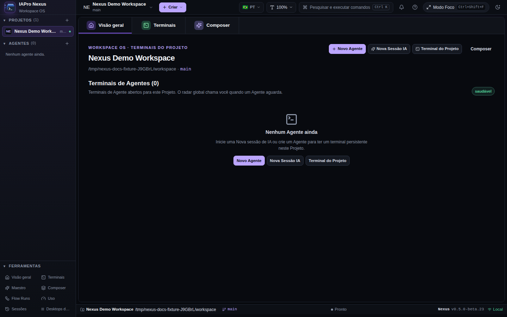

# IAPro Nexus

**A local workstation for operating coding agents.**

Projects, persistent agents, supervised terminal sessions, providers, worktrees and automation in one Web, Desktop and CLI experience.

<p align="center"><a href="README.md">Português</a> · <strong>English</strong> · <a href="README.es.md">Español</a></p>



## TL;DR

IAPro Nexus is a local workstation for working with coding agents. It organizes projects, persistent agents, sessions, supervised terminals, providers, worktrees and usage/quota around one Core. The simplest path is: open a project, create an AI Session, choose a provider and work in the terminal. Composer, Flow, Mission and Maestro are progressive layers, not prerequisites for direct work.

## Start in minutes

```bash
git clone https://github.com/kivervinicius/ai-cli.git
cd ai-cli
bun --cwd web install --frozen-lockfile
make build
./nexus doctor
./nexus web
```

Then follow **+ New → AI Session → provider → terminal**. You do not need Composer, Flow or Mission for direct work.

## Web, Desktop and CLI

| Surface | Best for |
| --- | --- |
| **Nexus Web** | Local browser control, observation and administration. |
| **Nexus Desktop** | Native Wails shell when the target platform has matching build/runtime evidence. |
| **Nexus CLI** | Scripting, diagnostics, headless operation and terminal workflows. |

See the [platform support matrix](docs/operations/platform-support.md) before treating a native capability as supported.

## Explore

- [Documentation map](docs/README.md)
- [Visual tour](docs/product/visual-tour.md)
- [Direct workflow](docs/product/direct.md)
- [Composer](docs/product/composer.md)
- [Flow](docs/product/flow.md)
- [Desktop](docs/desktop/overview.md)
- [Architecture](docs/architecture/overview.md)
- [Troubleshooting](docs/operations/troubleshooting.md)

The [Maestro integration](docs/product/maestro.md) is optional for the Direct path. Claims about support, usage and continuity are evidence-bound; planned or experimental capabilities are labeled as such.

## Community

[Security](SECURITY.md) · [Support](SUPPORT.md) · [Governance](GOVERNANCE.md) · [Roadmap](ROADMAP.md) · [Changelog](CHANGELOG.md) · [MIT License](LICENSE)
