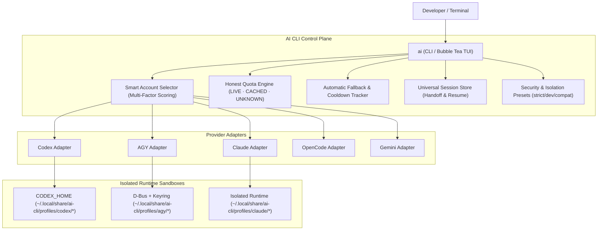

<div align="center">

# 🧠 AI CLI Control Plane

**The Intelligent Local Control Plane for AI Coding CLIs**  
*Multiple Identities · Multi-Provider · Strict Isolation · Real Quotas · Smart Selection · Anti-Rate-Limit*

---

[](https://golang.org)
[](https://opensource.org/licenses/MIT)
[](https://github.com/kivervinicius/ai-cli/releases)
[](docs/ARCHITECTURE.md)
[]()

[**Português**](README.md) • [**English**](README.en.md)

</div>

---

## 📖 Overview

**AI CLI** is a lightweight local **Control Plane** built in Go for developers and teams using multiple AI coding assistants in their terminal (including **OpenAI Codex**, **Google AGY / Antigravity**, **Claude Code**, **OpenCode**, and **Gemini CLI**).

It securely manages multiple account identities, isolates authentication credentials in dedicated per-profile sandboxes, tracks honest usage quotas, automatically selects the optimal account for each execution, and resumes conversations across accounts without rate-limit disruptions.

```text
 ┌────────────────────────────────────────────────────────────────────────────────────────┐
 │  AI CLI Control Plane v0.3.0                             Workspace: ~/tools/ai-manager │
 ├─────────────────────────┬──────────────────────────────────────────────────────────────┤
 │ Providers               │ Accounts (Codex)                                             │
 │                         │                                                              │
 │ ▸ ● Codex             2 │ ▸ ● [1] openai-work          ChatGPT Plus  [███████░░░] 70% ★│
 │   ● AGY               2 │   ● [2] openai-personal      ChatGPT Plus  [██████████] 100% │
 │   ○ Claude            0 │                                                              │
 │   ○ OpenCode          0 │                                                              │
 │   ○ Gemini            0 │                                                              │
 ├─────────────────────────┴──────────────────────────────────────────────────────────────┤
 │ Recent Sessions (Universal Index)                                                      │
 │                                                                                        │
 │ ▸ [1] 12m ago    # REFACTOR CONTROL PLANE                 [AGY   ]  ~/tools/ai-manager │
 │   [2] yesterday  Verify types and linting                [CODEX ]  ~/tools/ai-manager   │
 │   [3] 2 days ago Fix concurrency edge cases              [CODEX ]  ~/tools/ai-manager   │
 │   [4] 3 days ago Security audit                          [AGY   ]  ~/projects          │
 ├────────────────────────────────────────────────────────────────────────────────────────┤
 │ Selected: Codex / openai-work  [Authenticated]                                         │
 │ Actions:  [Enter/1-9] Run  [c] Continue Latest  [r] Resume Modal  [s] Quotas  [l] Login│
 │ AUTO: openai-personal (100% capacity) is optimal for new sessions                     │
 ├────────────────────────────────────────────────────────────────────────────────────────┤
 │ [↑/↓] Navigate  [←/→/Tab] Switch Box  [1-9] Quick Launch  [/] Search  [q/Esc] Quit     │
 └────────────────────────────────────────────────────────────────────────────────────────┘
```

---

## 🌟 Key Features

### 1. 🛡️ Multi-Account Sandboxing & Credential Isolation
- **Strictly Isolated State:** Each profile maintains its own isolated `HOME`, `XDG_DATA_HOME`, `XDG_CONFIG_HOME`, private D-Bus session, and dedicated `gnome-keyring-daemon` vault.
- **Zero Token Collisions:** Google OAuth tokens, OpenAI, Anthropic, and custom API keys are restricted to secure per-profile directories with strict `0600` permissions.
- **Configurable Isolation Presets:** Choose between `developer` (preserves git context and dotfiles), `strict` (hermetic sandbox), and `compat`.
- **Preserves Workspace Context:** Your working directory (`CWD`), user UID/GID, shell configurations, and git repositories remain fully preserved.

### 2. 🧠 Smart Account Selector
The scheduler evaluates multiple live factors to pick the optimal profile for each run:
- **Multi-Factor Scoring:** Considers remaining quota capacity, workspace bindings, default preferences, user priorities, and Pro tiers.
- **Full Transparency (`ai explain <provider>`):** Inspect the exact score breakdown:
  ```bash
  $ ai explain agy
  === Smart Account Selection Explanation: AGY ===
  Evaluation of all candidate profiles:

  Optimal Choice: google-work (Reason: authenticated, 92% capacity (+73.9), default profile (+25.0), pro tier (+15.0))

  PROFILE            ELIGIBLE   SCORE    BREAKDOWN / REJECTION
  google-work        YES        213.9    authenticated, 92% capacity (+73.9), default profile (+25.0), pro tier (+15.0)
  google-personal    YES        195.0    authenticated, 100% capacity (+80.0), pro tier (+15.0)
  ```

### 3. ⚡ Automatic Fallback & Cooldown Tracker
- **Cycle-Safe Recovery:** When a profile hits HTTP 429 or runs out of credits during execution, AI CLI detects the failure, records cooldown, and seamlessly retries with the next best account.
- **Loop Prevention:** Each profile is tested at most once per execution cycle.

### 4. 📊 Honest & Real Quota Engine (`ai usage`)
- **No Fabricated Quotas:** Eliminates fake 100% assumptions. Accurately reports `LIVE` (API/CLI probed), `CACHED` (valid local state), `RATE_LIMITED`, or `UNKNOWN`.
- **5-Hour and Weekly Windows:** Real-time visibility into quota reset timelines.

```bash
$ ai usage
```
```text
PROVIDER   PROFILE          ACCOUNT                  PLAN             CAPACITY / 5H                STATUS
agy        google-work      work@company.com         Google AI Pro    [█████████░] 92%             CACHED
agy        google-personal  dev@gmail.com            Google AI Pro    [██████████] 100%            CACHED
codex      openai-work      work@company.com         ChatGPT Plus     [███████░░░] 70%             CACHED
codex      openai-personal  dev@gmail.com            ChatGPT Plus     [██████████] 100%            CACHED
```

### 5. 🔄 Universal Session Handoff & Resume
- **Cross-Provider Index:** Instantly discover and filter conversations across all providers (`ai sessions` or `/` in TUI).
- **Cross-Account Resumption:** Continue any past conversation using a different account that has available quota:
  ```bash
  ai resume <session-id> [provider:profile]
  ```
- **Interactive Resume Modal:** Press `[r]` or `[Enter]` on any recent session in the TUI to choose a profile with auto-recommendations.

### 6. 📁 Workspace & Project Bindings
Pin repository directories to dedicated profiles (e.g. work vs. personal):
```bash
# Bind current workspace to work profile
ai bind codex:openai-work

# List all discovered workspaces
ai workspaces
```

### 7. 🔌 5 Natively Supported Providers
| Provider | ID | Capabilities |
| :--- | :--- | :--- |
| **OpenAI Codex** | `codex` | Login, 5h/Weekly Quota, Native Resume, `CODEX_HOME` Isolation |
| **Google AGY / Antigravity** | `agy` | Login, Gemini/Claude Quotas, Keyring Isolation, D-Bus Sandbox |
| **Anthropic Claude Code** | `claude` | Login, Detection, Isolated Runtime |
| **OpenCode** | `opencode` | Multi-model Detection and Execution |
| **Gemini CLI** | `gemini` | Google OAuth Authentication, Detection |

---

## 🚀 Installation & Quick Start

### Prerequisites
- **Go 1.22+** installed.
- One or more official AI coding CLIs installed (`codex`, `agy`, `claude`, etc.).

### Option 1: Fast Build & Install (Linux / macOS)
```bash
git clone https://github.com/kivervinicius/ai-cli.git
cd ai-cli
make install
```

### Option 2: PowerShell Installation (Windows / PowerShell Core)
```powershell
git clone https://github.com/kivervinicius/ai-cli.git
cd ai-cli
.\install.ps1
```

### Option 3: Manual Go Build
```bash
go build -ldflags="-s -w" -o ai ./cmd/ai
mkdir -p ~/.local/bin
cp ai ~/.local/bin/ai
chmod +x ~/.local/bin/ai
```

Ensure the target install directory is in your `$PATH`.

---

## 🐚 Shell Completion (Bash, Zsh, Fish, and PowerShell)

Enable full tab completion for providers, profiles, sessions, and flags:

### Bash
```bash
source <(ai completion bash)
# Persist in ~/.bashrc:
echo 'source <(ai completion bash)' >> ~/.bashrc
```

### Zsh
```zsh
source <(ai completion zsh)
# Persist in ~/.zshrc:
echo 'source <(ai completion zsh)' >> ~/.zshrc
```

### Fish
```fish
ai completion fish | source
```

### PowerShell (Windows & pwsh)
```powershell
ai completion powershell | Out-String | Invoke-Expression

# Persist in your $PROFILE:
Add-Content $PROFILE "`nai completion powershell | Out-String | Invoke-Expression"
```

---

## 💻 CLI Command Reference

### Interactive TUI & Execution
| Command | Description |
| :--- | :--- |
| `ai` | Launches the interactive Bubble Tea control plane TUI. |
| `ai <provider> [args...]` | Runs the provider with automatic smart account selection (e.g. `ai codex -m gpt-5`). |
| `ai <provider>:<profile> [args...]` | Directly runs with the specified profile (e.g. `ai agy:work -c`). |
| `ai explain <provider>` | Explains why the Smart Account Selector chose a specific account. |

### Profile & Authentication Management
| Command | Description |
| :--- | :--- |
| `ai profiles` / `ai list` | Lists all configured profiles, accounts, plans, and statuses. |
| `ai add <provider> <name>` | Creates a new isolated profile and initializes its sandbox. |
| `ai login <provider> <name>` | Triggers official CLI authentication for the profile. |
| `ai logout <provider> <name>` | Removes credentials from the profile. |
| `ai use <provider> <name>` | Sets the default profile for a provider. |
| `ai rename <provider> <old> <new>` | Renames a profile while preserving session history. |
| `ai remove <provider> <name>` | Safely deletes a profile and its isolated credentials. |

### Quotas & Sessions
| Command | Description |
| :--- | :--- |
| `ai usage` | Unified quota monitor across all accounts and providers. |
| `ai usage <provider> <name>` | Displays detailed limits for a specific profile. |
| `ai sessions` | Lists unified recent session history from all providers. |
| `ai sessions search <query>` | Searches sessions by title, ID, or workspace. |
| `ai resume <id> [profile]` | Resumes a conversation with a specific or optimal profile. |

### Workspaces & Configuration
| Command | Description |
| :--- | :--- |
| `ai bind <provider>:<profile>` | Binds current directory to a specific profile. |
| `ai unbind <provider>` | Removes workspace binding for a provider. |
| `ai workspaces` | Lists all discovered workspaces and their active bindings. |
| `ai current` | Shows active profile and bindings for current workspace. |
| `ai config validate` | Validates configuration file integrity. |

### Diagnostics, Security & Observability
| Command | Description |
| :--- | :--- |
| `ai doctor` | Performs diagnostic health checks (D-Bus, keyrings, CLIs, permissions). |
| `ai security` | Audits file permissions and validates credential isolation. |
| `ai stats` | Displays aggregated usage metrics, success rates, and rate limits. |
| `ai history` | Shows recent execution telemetry and event logs. |
| `ai paths` | Displays XDG data, config, and state directories. |

---

## 🏗️ Architecture & Security Model



### Security Guarantees:
- 🔒 **Strict `0600` Permissions:** Credentials, OAuth tokens, and private keys are never accessible by other system users.
- 🔒 **Automatic Redaction:** Telemetry logs and diagnostic dumps mask JWT tokens, API keys, and sensitive tokens.
- 🔒 **Process Isolation:** Keyring daemons run in isolated D-Bus sessions per profile.

---

## 🤝 Contributing

Contributions, new provider adapters, and improvements are welcome!
1. Fork the repository.
2. Create your feature branch (`git checkout -b feat/new-feature`).
3. Commit your changes (`git commit -m 'feat: add new adapter'`).
4. Open a Pull Request.

---

## 📄 License

Distributed under the **MIT License**. See [`LICENSE`](LICENSE) for details.
