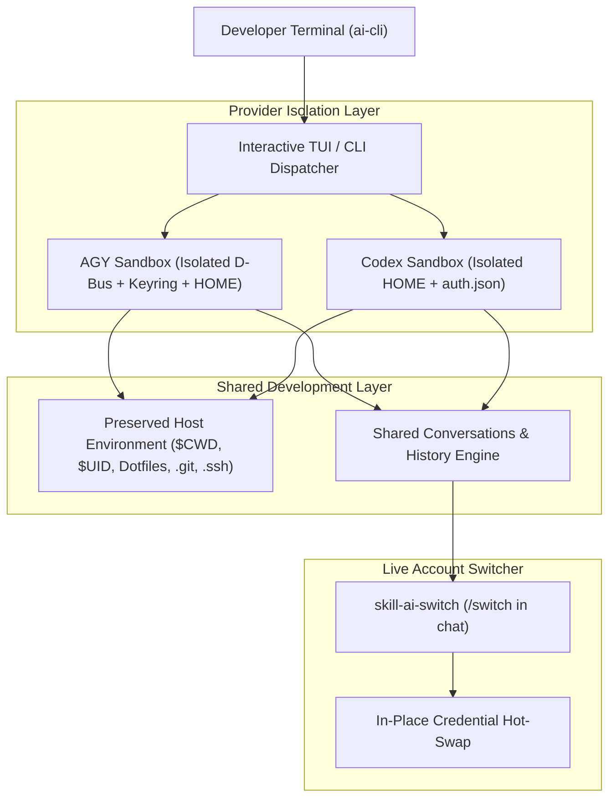

<p align="center">
  
</p>

<p align="center">
  <a href="https://golang.org"></a>
  <a href="LICENSE"></a>
  <a href="https://kernel.org"></a>
  
</p>

<p align="center">
  <a href="README.md">🇧🇷 Português (Brasil)</a> &nbsp;|&nbsp; <strong>English</strong>
</p>

<h3 align="center">
  ⚡ Isolated Multi-Account Manager &amp; Live Quota Supervisor for OpenAI Codex &amp; Google AGY
</h3>

---

**AI Manager (`ai`)** is a fast, isolated multi-account manager, sandbox launcher, and rate-limit supervisor for **OpenAI Codex** and **Google Antigravity (AGY)** on Linux.

It allows developers to manage multiple AI developer accounts seamlessly, switch accounts in real time **without leaving active chat sessions**, monitor live **5-Hour and Weekly Quotas**, and resume conversations across different accounts when rate limits (429) occur.

---

## 📸 Interactive Terminal Interface (TUI)

Launch the interactive manager at any time simply by running `ai`:

```text
┌──────────────────────────────────────────────────────────────────────────────────────────────┐
│ AI Manager v0.2.0                                                   [Project: backend-api]   │
│  Tabs:   [ 1. Accounts & Profiles ]    [ 2. Recent Conversations ]                           │
├──────────────────────────────────────────────────────────────────────────────────────────────┤
│  CONFIGURED ACCOUNTS & PROFILES:                                                             │
│                                                                                              │
│ > [1] AGY   google-work            work.team@gmail.com              Google AI Pro   ★ (Default)│
│   [2] AGY   google-personal        alex.dev@gmail.com               Google AI Pro            │
│   [3] CODEX openai-work            alex@company.com                 ChatGPT Plus    ★ (Default)│
│   [4] CODEX openai-personal        alex.personal@gmail.com          ChatGPT Plus             │
│                                                                                              │
├──────────────────────────────────────────────────────────────────────────────────────────────┤
│  [Enter] Start     [c] Continue Last      [d] Set Default     [s] View Quotas & /usage       │
│  [Tab] Conversations   [↑/↓] Navigate       [1-9] Quick Select  [q] Quit                     │
└──────────────────────────────────────────────────────────────────────────────────────────────┘
```

---

## 🌟 Key Features

### 1. 🛡️ Multi-Account Sandbox & Credential Isolation
- **Isolated State:** Each account gets its own isolated `HOME`, `XDG_DATA_HOME`, `XDG_CONFIG_HOME`, private D-Bus session, and dedicated `gnome-keyring-daemon` secret store.
- **Zero Token Collision:** Google OAuth tokens and OpenAI auth tokens are stored strictly in their profile jail, eliminating session overrides.
- **Shared Project Context:** Preserves your exact working directory (`CWD`), user UID/GID, dotfiles (`.bashrc`, `.zshrc`, `.gitconfig`, `.ssh`), and shared project context across all accounts.

### 2. ⚡ In-Session Account Switching (`/switch` Skill)
Switch accounts directly from within the chat **without closing the terminal**:
```text
User: /switch google-personal
Agent: ✓ Successfully switched to AGY:google-personal (alex.dev@gmail.com - Google AI Pro).
       Upcoming messages will use this account's quota.
```

### 3. 🔄 Anti-Rate-Limit & Instant Conversation Continuation
When a model quota window is exhausted:
- Press `[Tab]` in the TUI to view **Recent Conversations**.
- Pick any recent conversation and press `[Enter]` to resume it immediately with another account.
- Direct CLI command:
  ```bash
  ai resume <conversation-id> agy:google-personal
  ```

### 4. 📊 Unified Real-Time Quota Monitor (`ai usage`)
Displays exact 5-Hour and Weekly limit progress matching the official Google AGY (`/usage`) and OpenAI Codex (`/status`) dashboards:

```bash
$ ai usage
```
```text
PROVIDER PROFILE              ACCOUNT                        PLAN             5H LIMIT                     WEEKLY LIMIT
agy      google-work          work.team@gmail.com            Google AI Pro    [████████████░░] 92%         [███████████░░░] 83%
agy      google-personal      alex.dev@gmail.com             Google AI Pro    [██████████████] 100%        [██████████████] 100%
codex    openai-work          alex@company.com               ChatGPT Plus     [██████████░░░░] 70%         [█████████████░] 95%
codex    openai-personal      alex.personal@gmail.com        ChatGPT Plus     [██████████████] 100%        [██████████████] 100%
```

#### Detailed Official CLI Cards (`ai usage <provider> <profile>` or press `[s]` in TUI):

```text
╭────────────────────────────────────────────────────────────────────────────────╮
│  >_ OpenAI Codex Status & Quota — openai-work                                  │
│                                                                                │
│ Visit https://chatgpt.com/codex/settings/usage for up-to-date                  │
│ information on rate limits and credits                                         │
│                                                                                │
│  Model:                gpt-5.6-sol (reasoning low, summaries auto)             │
│  Account:              alex@company.com (ChatGPT Plus)                         │
│                                                                                │
│  5h limit:             [██████████████░░░░░░] 70% left (resets 17:34)          │
│  Weekly limit:         [███████████████████░] 95% left (resets 12:34 on 3 Sep) │
╰────────────────────────────────────────────────────────────────────────────────╯
```

---

## 🚀 Quick Start & Installation

### Option 1: Fast Build & Install
```bash
git clone https://github.com/kivervinicius/ai-cli.git
cd ai-cli
make install
```

### Option 2: Standalone Go Build
```bash
go build -buildvcs=false -o ai ./cmd/ai
mkdir -p ~/.local/bin
cp ai ~/.local/bin/ai
chmod +x ~/.local/bin/ai
```

### Shell Autocompletion (Bash & Zsh)
Add autocomplete for all profiles, subcommands, and conversations:

**Bash:**
```bash
source <(ai completion bash)
# Or persist in ~/.bashrc:
ai completion bash >> ~/.bashrc
```

**Zsh:**
```zsh
source <(ai completion zsh)
```

---

## 💻 CLI Command Reference & Cheat Sheet

| Command | Description |
| :--- | :--- |
| `ai` | Opens the full interactive TUI (Profiles, Accounts, Quotas, Recent Conversations). |
| `ai list` | Lists all configured profiles with accounts, plans, and defaults. |
| `ai usage` | Unified 5H and Weekly Quota monitor with visual progress bars. |
| `ai usage <provider> <name>` | Displays detailed official model quota card. |
| `ai switch <provider> <name>` | Switches active profile and default credentials in real time. |
| `ai resume` | Pick a recent conversation and choose which account to continue with. |
| `ai resume <id> <profile>` | Instant resume of conversation ID with target profile. |
| `ai add <codex\|agy> <name>` | Creates a new isolated profile and triggers login flow. |
| `ai login <provider> <name>` | Authenticates or refreshes OAuth tokens for a profile. |
| `ai codex:<name> [args...]` | Runs Codex directly with that profile (e.g. `ai codex:openai-1 --yolo`). |
| `ai agy:<name> [args...]` | Runs AGY directly with that profile (e.g. `ai agy:google-1 -c`). |
| `ai remove <provider> <name>` | Safely deletes a profile and its isolated credentials. |
| `ai doctor` | Performs diagnostic health checks on dependencies (dbus, keyring, CLIs). |
| `ai inspect <provider> <name>` | Displays non-secret execution paths, UID/GID, and isolation variables. |

---

## 🏗️ Architecture & Security Model



### Security Guarantees:
- 🔒 **Zero Token Leakage:** Authentication keys, JWT payloads, and OAuth tokens are strictly confined to permission `0600` directories.
- 🔒 **Process Isolation:** Uses `dbus-run-session` and private `gnome-keyring-daemon` sockets so applications never mix secret stores.
- 🔒 **Non-Secret Inspection:** `ai inspect` only reveals metadata, directory paths, and runtime flags, never sensitive tokens.

---

## 🤝 Contributing

Contributions, feature requests, and suggestions are welcome!
Feel free to open an issue or pull request.

---

## 📄 License

Distributed under the **MIT License**. See [`LICENSE`](LICENSE) for more information.
