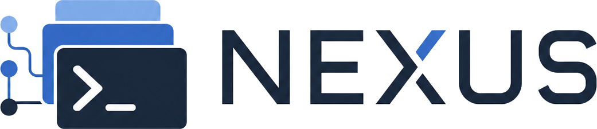

<p align="center"></p>

<p align="center">
  <a href="README.md">🇧🇷 Português (Brasil)</a> &nbsp;|&nbsp; <a href="README.en.md">🇬🇧 English</a> &nbsp;|&nbsp; <strong>🇪🇸 Español</strong>
</p>

# Manual de IAPro Nexus

IAPro Nexus es un espacio de control local para agentes de programación con IA. Reúne proyectos, agentes persistentes, terminales, recursos, cuotas, sesiones y la orientación de Orquestrador Maestro en una interfaz web y dos interfaces de terminal.

## Funciones principales

- Selección inteligente entre Codex, AGY, Claude, OpenCode, Gemini y Cursor.
- Perfiles aislados, fallback automático y seguimiento de cuotas.
- Proyectos duraderos con Agentes, Misiones, historial y continuidad de sesiones.
- Workspace OS con pestañas, divisiones, ventanas independientes y paleta de comandos.
- Control local: los tokens y credenciales permanecen en los directorios de cada proveedor.

## Instalación

Linux y macOS:

```bash
curl -fsSL https://raw.githubusercontent.com/kivervinicius/ai-cli/main/install.sh | bash
nexus doctor
nexus web
```

Windows PowerShell:

```powershell
iwr https://raw.githubusercontent.com/kivervinicius/ai-cli/main/install.ps1 -UseBasicParsing | iex
nexus doctor
nexus web
```

## Idioma

La interfaz web detecta el idioma del navegador. Se puede cambiar inmediatamente en **Configuración → Idioma**; la elección queda guardada en el navegador.

El CLI detecta el idioma del sistema. La precedencia es: flag, variable de entorno, configuración persistida, sistema e inglés como fallback.

```bash
nexus --lang es help
AI_CLI_LANG=pt-BR nexus doctor
nexus config language es
nexus config language auto
```

Los locales disponibles son `pt-BR`, `en` y `es`. Los nombres de comandos, flags, claves JSON, enums, rutas, logs y mensajes libres de proveedores no se traducen.

## Uso esencial

```bash
nexus                         # abre Workspace OS Web (predeterminado)
nexus web                     # abre explícitamente Workspace OS Web
nexus providers               # proveedores detectados
nexus profiles                # perfiles configurados
nexus add codex trabajo       # crea un perfil
nexus codex:trabajo           # inicia un perfil específico
nexus usage                   # cuotas y capacidad
nexus sessions                # sesiones recientes
nexus doctor                  # diagnóstico local
```

### Banderas Canónicas Universales y Ayuda Fusionada

Nexus normaliza las opciones de CLI más utilizadas y las traduce automáticamente a cada proveedor:

| Bandera Canónica | Descripción | Traducción en AGY | Traducción en Codex | Traducción en Claude |
|---|---|---|---|---|
| `--yolo` / `-y` | Omite confirmaciones y autoriza herramientas | `--dangerously-skip-permissions` | `--dangerously-bypass-approvals-and-sandbox` | `--dangerously-skip-permissions` |
| `--continue` / `-c` | Continúa la última conversación | `--continue` | `resume --last` | `--continue` |
| `--resume <id>` / `-r <id>` | Reanuda una sesión por ID | `--conversation=<id>` | `resume <id>` | `--resume <id>` |
| `--print` / `-p` | Modo sin interfaz interactiva | `--print` | `exec` | `--print` |
| `--effort <level>` | Esfuerzo de razonamiento (low, medium, high) | `--effort <level>` | `-c model_reasoning_effort="<level>"` | — |
| `--plan` | Modo de planificación | `--mode plan` | — | — |

Para consultar la ayuda fusionada:
```bash
nexus agy --help       # o: nexus help agy
nexus codex --help     # o: nexus help codex
nexus claude --help    # o: nexus help claude
```
Nexus presenta en primer lugar la tabla comparativa con los **aliases canónicos** y a continuación la **ayuda oficial completa** del binario.


## Desarrollo

Requisitos: Go 1.25+, Bun y las CLIs de los proveedores deseados.

```bash
go test ./...
cd web
bun install --frozen-lockfile
bun run typecheck
bun run lint
bun run test
bun run build
```

El build web genera los archivos estáticos embebidos por el servidor Go. Consulte también los guías localizados en [`docs/`](docs/).

## Seguridad y privacidad

- La interfaz web escucha en loopback por defecto.
- La exposición remota requiere una decisión explícita y debe usar túnel SSH o VPN privada.
- Los handoffs aplican redacción de secretos.
- Las salidas `--json` son contratos estables e independientes del idioma.

Licencia: [Apache 2.0](LICENSE).
