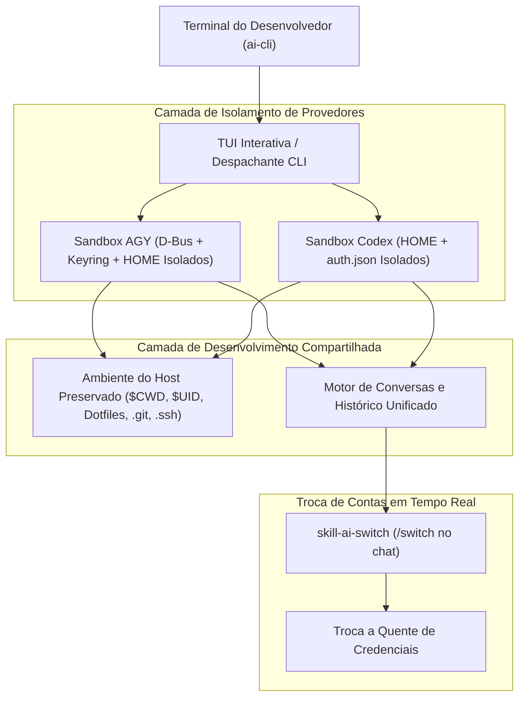

<p align="center">
  
</p>

<p align="center">
  <a href="https://golang.org"></a>
  <a href="LICENSE"></a>
  <a href="https://kernel.org"></a>
  
</p>

<p align="center">
  <strong>Português (Brasil)</strong> &nbsp;|&nbsp; <a href="README.en.md">🇬🇧 English</a>
</p>

<h3 align="center">
  ⚡ Gerenciador Multi-Contas Isolado &amp; Supervisor de Quotas em Tempo Real para OpenAI Codex e Google AGY
</h3>

---

O **AI Manager (`ai`)** é um gerenciador multi-contas ultra rápido, inicializador em sandbox e supervisor contra bloqueios de rate limit (429) para o **OpenAI Codex** e **Google Antigravity (AGY)** no Linux.

Ele permite gerenciar múltiplas contas de IA de forma totalmente isolada, alternar contas em tempo real **sem sair da sessão ativa do chat**, monitorar cotas **5 Horas e Semanais** ao vivo e continuar conversas entre diferentes contas em menos de 0,5s quando o limite esgota.

---

## 📸 Interface de Terminal Interativa (TUI)

Inicie o painel interativo a qualquer momento executando `ai`:

```text
┌──────────────────────────────────────────────────────────────────────────────────────────────┐
│ AI Manager v0.2.0                                                   [Projeto: backend-api]   │
│  Abas:   [ 1. Contas & Perfis ]    [ 2. Conversas Recentes ]                                 │
├──────────────────────────────────────────────────────────────────────────────────────────────┤
│  CONTAS & PERFIS CONFIGURADOS:                                                               │
│                                                                                              │
│ > [1] AGY   google-work            work.team@gmail.com              Google AI Pro   ★ (Padrão)│
│   [2] AGY   google-personal        alex.dev@gmail.com               Google AI Pro            │
│   [3] CODEX openai-work            alex@company.com                 ChatGPT Plus    ★ (Padrão)│
│   [4] CODEX openai-personal        alex.personal@gmail.com          ChatGPT Plus             │
│                                                                                              │
├──────────────────────────────────────────────────────────────────────────────────────────────┤
│  [Enter] Iniciar   [c] Continuar Última   [d] Tornar Padrão   [s] Ver Quotas & /usage        │
│  [Tab] Conversas    [↑/↓] Navegar            [1-9] Seleção Rápida   [q] Sair                  │
└──────────────────────────────────────────────────────────────────────────────────────────────┘
```

---

## 🌟 Principais Recursos

### 1. 🛡️ Sandbox Multi-Conta & Isolamento de Credenciais
- **Estado Isolado:** Cada perfil tem seu próprio `HOME`, `XDG_DATA_HOME`, `XDG_CONFIG_HOME`, sessão privada D-Bus e cofre `gnome-keyring-daemon` dedicado.
- **Zero Colisão de Tokens:** Tokens OAuth do Google e tokens de autenticação da OpenAI ficam estritamente isolados em sua pasta de perfil, eliminando sobrescritas acidentais de sessão.
- **Contexto de Projeto Compartilhado:** Preserva exatamente seu diretório de trabalho atual (`CWD`), usuário UID/GID, dotfiles (`.bashrc`, `.zshrc`, `.gitconfig`, `.ssh`) e o contexto compartilhado dos seus repositórios.

### 2. ⚡ Troca de Contas Durante a Sessão (Skill `/switch`)
Alterne perfis de autenticação diretamente de dentro do chat **sem precisar fechar o terminal ou reiniciar o CLI**:
```text
User: /switch google-personal
Agent: ✓ Alternado com sucesso para AGY:google-personal (alex.dev@gmail.com - Google AI Pro).
       As próximas mensagens continuarão com a quota desta conta.
```

### 3. 🔄 Continuação Instantânea de Conversas (Anti-Rate-Limit)
Quando o limite de quota de uma conta esgotar:
- Pressione `[Tab]` na TUI para ver as **Conversas Recentes**.
- Selecione qualquer conversa recente e aperte `[Enter]` para continuá-la de onde parou com outra conta que possua saldo.
- Comando direto via CLI:
  ```bash
  ai resume <conversation-id> agy:google-personal
  ```

### 4. 📊 Monitor de Quotas Unificado em Tempo Real (`ai usage`)
Exibe com precisão as cotas de 5 Horas e Semanais compatíveis com os painéis oficiais do Google AGY (`/usage`) e OpenAI Codex (`/status`):

```bash
$ ai usage
```
```text
PROVIDER PROFILE              ACCOUNT                        PLAN             5H LIMIT                     WEEKLY LIMIT
agy      google-work          work.team@gmail.com            Google AI Pro    [████████████░░] 92%         [███████████░░░] 83%
agy      google-personal      alex.dev@gmail.com             Google AI Pro    [██████████████] 100%        [██████████████] 100%
codex    openai-work          alex@company.com               ChatGPT Plus     [██████████░░░░] 70%         [█████████████░] 95%
codex    openai-personal      alex.personal@gmail.com        ChatGPT Plus     [██████████████] 100%        [██████████████] 100%
```

#### Cartões Detalhados Oficiais do CLI (`ai usage <provider> <perfil>` ou tecla `[s]` na TUI):

```text
╭────────────────────────────────────────────────────────────────────────────────╮
│  >_ OpenAI Codex Status & Quota — openai-work                                  │
│                                                                                │
│ Visite https://chatgpt.com/codex/settings/usage para informações atualizadas   │
│ sobre limites de taxa e créditos                                              │
│                                                                                │
│  Modelo:               gpt-5.6-sol (reasoning low, summaries auto)             │
│  Conta:                alex@company.com (ChatGPT Plus)                         │
│                                                                                │
│  Limite 5h:            [██████████████░░░░░░] 70% restante (renova às 17:34)   │
│  Limite Semanal:       [███████████████████░] 95% restante (renova 12:34 3 Set)│
╰────────────────────────────────────────────────────────────────────────────────╯
```

---

## 🚀 Instalação e Início Rápido

### Opção 1: Compilação e Instalação Automática
```bash
git clone https://github.com/kivervinicius/ai-cli.git
cd ai-cli
make install
```

### Opção 2: Compilação Manual em Go
```bash
go build -buildvcs=false -o ai ./cmd/ai
mkdir -p ~/.local/bin
cp ai ~/.local/bin/ai
chmod +x ~/.local/bin/ai
```

### Autocompletar no Shell (Bash e Zsh)
Ative o autocompletar de perfis, subcomandos e conversas:

**Bash:**
```bash
source <(ai completion bash)
# Ou persistir no ~/.bashrc:
ai completion bash >> ~/.bashrc
```

**Zsh:**
```zsh
source <(ai completion zsh)
```

---

## 💻 Guia Rápido de Comandos CLI

| Comando | Descrição |
| :--- | :--- |
| `ai` | Abre a TUI interativa completa (Perfis, Contas, Quotas, Conversas Recentes). |
| `ai list` | Lista todos os perfis configurados com contas, planos e perfil padrão. |
| `ai usage` | Monitor unificado de cotas 5H e Semanais com barras de progresso visuais. |
| `ai usage <provider> <nome>` | Exibe o cartão detalhado oficial de cota do modelo. |
| `ai switch <provider> <nome>` | Alterna o perfil ativo e as credenciais em tempo real. |
| `ai resume` | Seleciona uma conversa recente e escolhe com qual conta continuar. |
| `ai resume <id> <perfil>` | Continuação instantânea de uma conversa usando o perfil especificado. |
| `ai add <codex\|agy> <nome>` | Cria um novo perfil isolado e dispara o fluxo de login. |
| `ai login <provider> <nome>` | Autentica ou renova tokens OAuth para um perfil. |
| `ai codex:<nome> [args...]` | Executa o Codex diretamente com aquele perfil (ex: `ai codex:openai-1 --yolo`). |
| `ai agy:<nome> [args...]` | Executa o AGY diretamente com aquele perfil (ex: `ai agy:google-1 -c`). |
| `ai remove <provider> <nome>` | Remove com segurança um perfil e suas credenciais isoladas. |
| `ai doctor` | Executa diagnósticos no sistema e checa dependências (dbus, keyring, CLIs). |
| `ai inspect <provider> <nome>` | Exibe caminhos de execução não-secretos, UID/GID e variáveis de isolamento. |

---

## 🏗️ Arquitetura e Modelo de Segurança



### Garantias de Segurança:
- 🔒 **Zero Vazamento de Tokens:** Chaves de autenticação, payloads JWT e tokens OAuth ficam restritos a diretórios com permissões estritas `0600`.
- 🔒 **Isolamento de Processos:** Usa `dbus-run-session` e sockets privados do `gnome-keyring-daemon` para isolar cofres de senhas entre contas.
- 🔒 **Inspeção Segura:** O comando `ai inspect` apenas exibe metadados, diretórios e flags de runtime, nunca credenciais sensíveis.

---

## 🤝 Contribuições

Contribuições, sugestões de melhorias e novas ideias são muito bem-vindas!
Sinta-se à vontade para abrir uma issue ou pull request.

---

## 📄 Licença

Distribuído sob a licença **MIT**. Consulte o arquivo [`LICENSE`](LICENSE) para obter mais informações.
