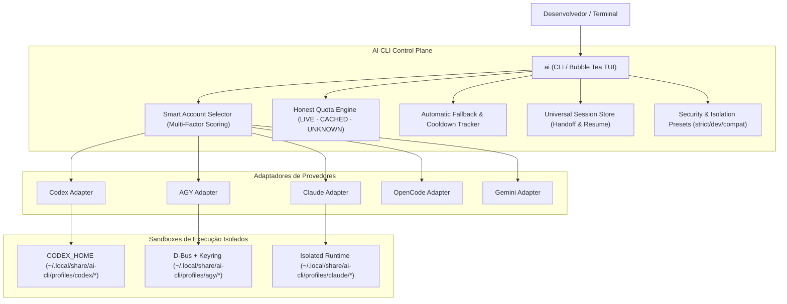

<div align="center">

# 🧠 AI CLI Control Plane

**O Control Plane Local Inteligente para Coding CLIs de IA**  
*Múltiplas Identidades · Multi-Provedor · Isolamento Estrito · Quotas Reais · Seleção Inteligente · Anti-Rate-Limit*

---

[](https://golang.org)
[](https://opensource.org/licenses/MIT)
[](https://github.com/kivervinicius/ai-cli/releases)
[](docs/ARCHITECTURE.md)
[]()

[**Português**](README.md) • [**English**](README.en.md)

</div>

---

## 📖 Visão Geral

O **AI CLI** é um **Control Plane local** desenvolvido em Go para desenvolvedores e equipes que utilizam múltiplos assistentes e CLIs de IA no terminal (como **OpenAI Codex**, **Google AGY / Antigravity**, **Claude Code**, **OpenCode** e **Gemini CLI**).

Ele gerencia de forma inteligente e segura múltiplas contas, isola autenticações e credenciais em sandboxes dedicados, monitora quotas de uso reais e autênticas, e seleciona automaticamente a melhor conta para cada execução ou retoma conversas sem bloqueios de rate limit.

```text
 ┌────────────────────────────────────────────────────────────────────────────────────────┐
 │  AI CLI Control Plane v0.3.0                             Workspace: ~/tools/ai-manager │
 ├─────────────────────────┬──────────────────────────────────────────────────────────────┤
 │ Providers               │ Accounts (Codex)                                             │
 │                         │                                                              │
 │ ▸ ● Codex             2 │ ▸ ● [1] openai-work          ChatGPT Plus  [███████░░░] 70% ★│
 │   ● AGY               2 │   ● [2] openai-personal      ChatGPT Plus  [██████████] 100% │
 │   ○ Claude            0 │                                                              │
 │   ○ OpenCode          0 │                                                              │
 │   ○ Gemini            0 │                                                              │
 ├─────────────────────────┴──────────────────────────────────────────────────────────────┤
 │ Recent Sessions (Universal Index)                                                      │
 │                                                                                        │
 │ ▸ [1] há 12 min  # REFACTOR CONTROL PLANE                 [AGY   ]  ~/tools/ai-manager │
 │   [2] ontem      Verificar tipagem e lint                [CODEX ]  ~/tools/ai-manager   │
 │   [3] há 2 dias  Corrigir problemas de concorrência      [CODEX ]  ~/tools/ai-manager   │
 │   [4] há 3 dias  Auditoria de segurança                  [AGY   ]  ~/projetos           │
 ├────────────────────────────────────────────────────────────────────────────────────────┤
 │ Selected: Codex / openai-work  [Authenticated]                                         │
 │ Actions:  [Enter/1-9] Run  [c] Continue Latest  [r] Resume Modal  [s] Quotas  [l] Login│
 │ AUTO: openai-personal (100% capacity) is optimal for new sessions                     │
 ├────────────────────────────────────────────────────────────────────────────────────────┤
 │ [↑/↓] Navegar  [←/→/Tab] Alternar Caixa  [1-9] Disparo Rápido  [/] Buscar  [q/Esc] Sair│
 └────────────────────────────────────────────────────────────────────────────────────────┘
```

---

## 🌟 Principais Recursos

### 1. 🛡️ Sandbox Multi-Conta & Isolamento de Credenciais
- **Estado Estritamente Isolado:** Cada perfil possui seu próprio diretório `HOME`, `XDG_DATA_HOME`, `XDG_CONFIG_HOME`, sessão privada D-Bus e cofre `gnome-keyring-daemon` dedicado.
- **Zero Colisão de Tokens:** Tokens OAuth do Google, credenciais OpenAI, Anthropic e chaves de API ficam estritamente isolados em sua pasta de perfil com permissões restritas `0600`.
- **Presets de Isolamento Configuráveis:** Escolha entre `developer` (compartilha dotfiles e contexto de git), `strict` (sandbox hermético) e `compat`.
- **Preservação de Contexto de Projeto:** Mantém seu diretório de trabalho (`CWD`), usuário UID/GID, configurações locais e repositórios intactos.

### 2. 🧠 Seleção Inteligente de Contas (Smart Account Selector)
O motor de agendamento avalia múltiplos fatores em tempo real para escolher a conta ideal:
- **Pontuação Multi-Fator:** Avalia capacidade restante de quota, bindings de workspace, perfil padrão, prioridade manual configurada e planos Pro.
- **Transparência Total (`ai explain <provider>`):** Entenda exatamente por que uma conta foi escolhida:
  ```bash
  $ ai explain agy
  === Smart Account Selection Explanation: AGY ===
  Evaluation of all candidate profiles:

  Optimal Choice: google-work (Reason: authenticated, 92% capacity (+73.9), default profile (+25.0), pro tier (+15.0))

  PROFILE            ELIGIBLE   SCORE    BREAKDOWN / REJECTION
  google-work        YES        213.9    authenticated, 92% capacity (+73.9), default profile (+25.0), pro tier (+15.0)
  google-personal    YES        195.0    authenticated, 100% capacity (+80.0), pro tier (+15.0)
  ```

### 3. ⚡ Fallback Automático & Cooldown Anti-Rate-Limit
- **Recuperação de Ciclo Seguro:** Quando uma conta atinge HTTP 429 ou esgota a quota durante uma execução, o AI CLI intercepta a falha, registra o cooldown e realiza fallback transparente para a próxima conta disponível com saldo.
- **Prevenção de Loops:** O sistema garante que cada conta só seja testada uma vez por ciclo de fallback.

### 4. 📊 Monitor de Quotas Reais e Honesto (`ai usage`)
- **Zero Quotas Fictícias:** Elimina suposições de 100%. Exibe com precisão o estado real da quota: `LIVE` (obtida via API/CLI), `CACHED` (estado local recente), `RATE_LIMITED` ou `UNKNOWN`.
- **Limites de 5 Horas e Semanais:** Visualização clara das janelas de reset de cada modelo.

```bash
$ ai usage
```
```text
PROVIDER   PROFILE          ACCOUNT                  PLAN             CAPACITY / 5H                STATUS
agy        google-work      work@company.com         Google AI Pro    [█████████░] 92%             CACHED
agy        google-personal  dev@gmail.com            Google AI Pro    [██████████] 100%            CACHED
codex      openai-work      work@company.com         ChatGPT Plus     [███████░░░] 70%             CACHED
codex      openai-personal  dev@gmail.com            ChatGPT Plus     [██████████] 100%            CACHED
```

### 5. 🔄 Retomada Universal de Sessões (Session Handoff)
- **Índice Unificado:** Descubra e pesquise instantaneamente conversas de todos os provedores (`ai sessions` ou `/` na TUI).
- **Handoff Entre Contas:** Continue uma conversa existente com outra conta que possua limite disponível:
  ```bash
  ai resume <session-id> [provider:profile]
  ```
- **Modal Interativo na TUI:** Pressione `[r]` ou `[Enter]` numa sessão recente para escolher a conta com sugestão automática do Smart Selector.

### 6. 📁 Bindings por Workspace / Projeto
Associe pastas de projetos a perfis específicos para uso automático de contas de trabalho ou pessoais:
```bash
# Vincular projeto atual à conta corporativa
ai bind codex:openai-work

# Listar workspaces e seus vínculos
ai workspaces
```

### 7. 🔌 5 Provedores Suportados Nativamente
| Provedor | Identificador | Capacidades |
| :--- | :--- | :--- |
| **OpenAI Codex** | `codex` | Login, Quota 5h/Semanal, Resume nativo, Isolamento `CODEX_HOME` |
| **Google AGY / Antigravity** | `agy` | Login, Quota Gemini/Claude, Keyring isolado, D-Bus sandbox |
| **Anthropic Claude Code** | `claude` | Login, Detecção de versão, Runtime isolado |
| **OpenCode** | `opencode` | Detecção e execução multi-modelo |
| **Gemini CLI** | `gemini` | Autenticação Google OAuth, Detecção |

---

## 🚀 Instalação e Início Rápido

### Pré-requisitos
- **Go 1.22+** instalado na máquina.
- Um ou mais CLIs oficiais instalados (`codex`, `agy`, `claude`, etc.).

### Opção 1: Compilação e Instalação Rápida
```bash
git clone https://github.com/kivervinicius/ai-cli.git
cd ai-cli
make install
```

### Opção 2: Compilação Manual
```bash
go build -ldflags="-s -w" -o ai ./cmd/ai
mkdir -p ~/.local/bin
cp ai ~/.local/bin/ai
chmod +x ~/.local/bin/ai
```

Certifique-se de que `~/.local/bin` está no seu `$PATH`.

---

## 🐚 Autocompletar no Shell (Bash, Zsh e Fish)

Ative o autocompletar completo de provedores, perfis, conversas e flags:

### Bash
```bash
source <(ai completion bash)
# Para persistir no ~/.bashrc:
echo 'source <(ai completion bash)' >> ~/.bashrc
```

### Zsh
```zsh
source <(ai completion zsh)
# Para persistir no ~/.zshrc:
echo 'source <(ai completion zsh)' >> ~/.zshrc
```

### Fish
```fish
ai completion fish | source
```

---

## 💻 Guia Completo de Comandos CLI

### Interface Interativa & Execução
| Comando | Descrição |
| :--- | :--- |
| `ai` | Abre a TUI interativa completa em Bubble Tea. |
| `ai <provider> [args...]` | Executa o provedor com seleção inteligente da melhor conta (ex: `ai codex -m gpt-5`). |
| `ai <provider>:<perfil> [args...]` | Executa diretamente com o perfil especificado (ex: `ai agy:work -c`). |
| `ai explain <provider>` | Exibe a pontuação e justificativa da seleção de conta do Smart Selector. |

### Gerenciamento de Perfis & Autenticação
| Comando | Descrição |
| :--- | :--- |
| `ai profiles` / `ai list` | Lista todos os perfis configurados, contas, planos e status. |
| `ai add <provider> <nome>` | Cria um novo perfil isolado e inicializa o sandbox. |
| `ai login <provider> <nome>` | Executa o fluxo de autenticação oficial do provedor. |
| `ai logout <provider> <nome>` | Remove as credenciais salvas do perfil. |
| `ai use <provider> <nome>` | Define o perfil padrão para o provedor. |
| `ai rename <provider> <antigo> <novo>` | Renomeia um perfil preservando histórico e sessões. |
| `ai remove <provider> <nome>` | Remove com segurança o perfil e suas credenciais. |

### Quotas & Conversas
| Comando | Descrição |
| :--- | :--- |
| `ai usage` | Monitor unificado de cotas 5H e Semanais com barras de progresso reais. |
| `ai usage <provider> <nome>` | Exibe os limites detalhados de uma conta específica. |
| `ai sessions` | Lista o histórico unificado de sessões recentes de todos os provedores. |
| `ai sessions search <termo>` | Pesquisa sessões por título, ID ou workspace. |
| `ai resume <id> [perfil]` | Retoma uma conversa específica com o perfil indicado ou com a melhor conta. |

### Workspaces & Configurações
| Comando | Descrição |
| :--- | :--- |
| `ai bind <provider>:<perfil>` | Vincula o diretório atual ao perfil especificado. |
| `ai unbind <provider>` | Remove o vínculo de workspace para o provedor. |
| `ai workspaces` | Lista todos os workspaces descobertos e seus vínculos ativos. |
| `ai current` | Exibe o perfil ativo e vínculos do workspace atual. |
| `ai config validate` | Valida a integridade do arquivo de configuração. |

### Auditoria, Diagnóstico & Observabilidade
| Comando | Descrição |
| :--- | :--- |
| `ai doctor` | Executa diagnósticos de sistema (D-Bus, keyrings, CLIs instalados, permissões). |
| `ai security` | Audita permissões de arquivos e valida o isolamento de credenciais. |
| `ai stats` | Exibe métricas agregadas de uso, taxas de sucesso e rate limits. |
| `ai history` | Exibe o log de eventos e telemetria de execuções recentes. |
| `ai paths` | Mostra os diretórios XDG de dados, configuração e estado. |

---

## 🏗️ Arquitetura e Modelo de Segurança



### Garantias de Segurança:
- 🔒 **Permissões Estritas `0600`:** Arquivos de credenciais, tokens OAuth e chaves privadas nunca são acessíveis por outros usuários do sistema operacional.
- 🔒 **Redação Automática:** Logs de telemetria e saídas de diagnóstico passam por filtros de redação que mascaram tokens JWT, chaves OpenAI/Anthropic e dados sensíveis.
- 🔒 **Isolamento de Processos:** Cofres de senhas do `gnome-keyring` rodam em instâncias D-Bus isoladas para cada perfil do AGY.

---

## 🤝 Contribuições

Contribuições, sugestões de novos provedores e melhorias são muito bem-vindas!
1. Faça um Fork do projeto.
2. Crie uma branch para sua feature (`git checkout -b feat/nova-feature`).
3. Envie seus commits (`git commit -m 'feat: adiciona novo adapter'`).
4. Abra um Pull Request.

---

## 📄 Licença

Distribuído sob a licença **MIT**. Consulte o arquivo [`LICENSE`](LICENSE) para obter mais informações.
