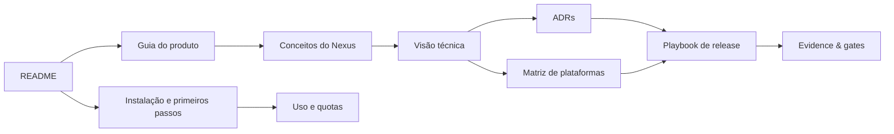

# IAPro Nexus — documentação

O IAPro Nexus é um Workspace OS local para coding agents: organiza projetos,
agentes persistentes, terminais reais, provedores, quotas e continuidade em uma
experiência única de CLI e Web. Esta página é o ponto de entrada da documentação
pública e técnica.

## Comece por aqui

| Perfil | Leitura recomendada |
| --- | --- |
| Quero entender o produto | [Guia do produto](community-preview/PRODUCT_GUIDE.md) |
| Quero instalar e usar | [README principal](../README.md) |
| Quero entender a arquitetura | [Visão técnica](community-preview/TECHNICAL_OVERVIEW.md) |
| Quero contribuir | [Guia de desenvolvimento](../DEV/README.md) e [Governança](../GOVERNANCE.md) |
| Quero publicar uma versão | [Playbook de release](community-preview/RELEASE_PLAYBOOK.md) |
| Quero verificar suporte | [Matriz de plataformas](platform/PLATFORM_SUPPORT_MATRIX.md) |
| Quero reportar vulnerabilidade | [Política de segurança](../SECURITY.md) |
| Quero usar o Composer | [Guia do Composer](nexus-composer-user-guide.md) |
| Quero operar o Flow | [Guia do Flow](nexus-flow-user-guide.md) |

## Mapa da documentação

## Princípio editorial

A documentação diferencia explicitamente:

- o que já foi implementado;
- o que foi verificado nativamente em cada sistema operacional;
- o que depende de credenciais ou infraestrutura externa;
- o que continua experimental ou planejado.

Não usamos uma promessa de suporte como substituto de evidência. A mesma regra
vale para quotas, continuidade de sessão, assinaturas de artefatos e integração
opcional com o Orquestrador Maestro.
