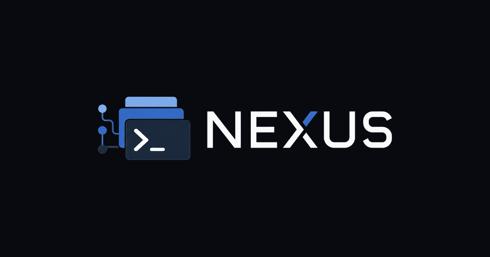
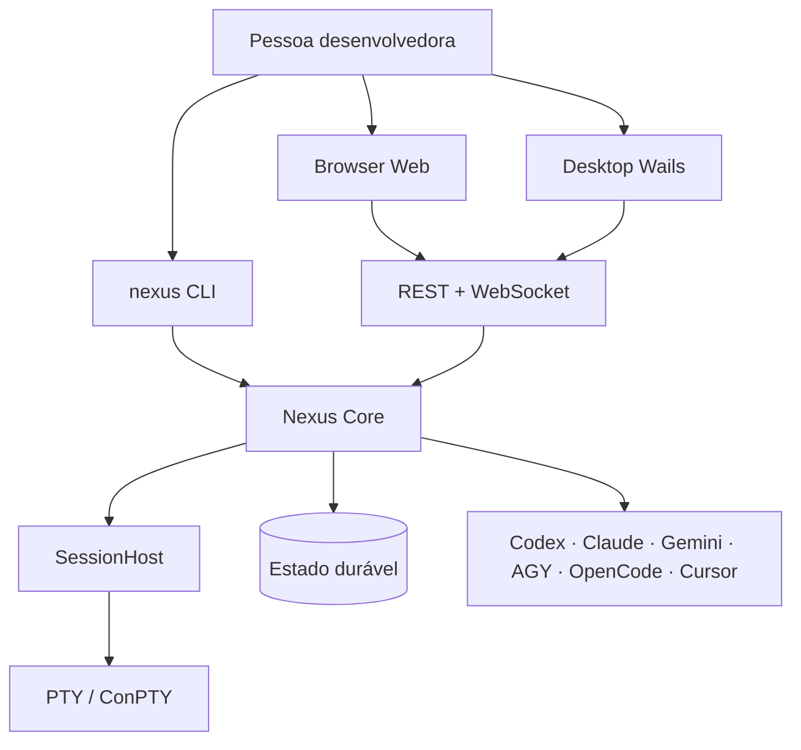
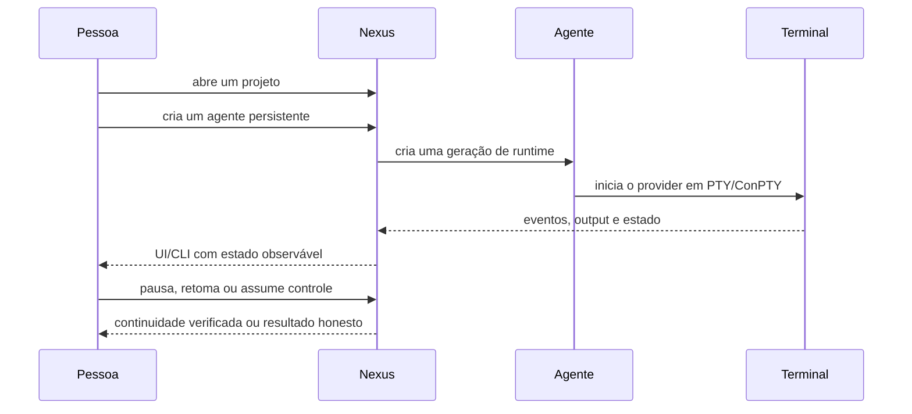

# IAPro Nexus — guia do produto

> Um workspace local para transformar coding agents isolados em um sistema de
> trabalho observável, persistente e seguro.

## O que o Nexus resolve

Usar vários coding agents normalmente significa alternar entre terminais,
pastas, perfis, contas e sessões sem uma visão comum. O Nexus reúne esse fluxo
em torno de quatro ideias simples:

1. **Projeto** — a raiz de trabalho e seus dados duráveis.
2. **Agente persistente** — uma identidade estável, independente do processo
   concreto que está executando naquele momento.
3. **Runtime** — a geração de execução que pode iniciar, parar, reconectar ou
   ser recuperada com estados honestos.
4. **Terminal real** — PTY/ConPTY supervisionado pelo Core e transmitido ao
   navegador por WebSocket.

## O que há de especial

### Uma experiência, duas superfícies

CLI, navegador e Desktop usam o mesmo Core, frontend React, API REST/WebSocket,
modelo de eventos e arquitetura de terminal. Isso reduz divergências e faz com
que uma correção de produto seja aplicada uma vez.

### Persistência sem fingir continuidade

O Nexus separa identidade do agente, geração do runtime e referência da sessão
do provedor. Assim, reiniciar o computador não transforma automaticamente uma
sessão nova em “a mesma sessão”. O produto informa se houve reconexão real,
resume nativo verificado, recuperação de contexto ou falha de continuidade.

### Uso e quotas com fonte explícita

Cada informação de uso carrega estado de verdade: `LIVE`, `CACHED`,
`ESTIMATED`, `UNKNOWN`, `RATE_LIMITED` ou `UNAVAILABLE`. `UNKNOWN` não é tratado
como zero, como 100% usado ou como autorização para o scheduler consumir um
recurso sem evidência.

### Maestro opcional

O Nexus executa runtime, sessões, projetos, worktrees, quotas e atualizações.
O Orquestrador Maestro acrescenta metodologia, skills, gates e processo quando
está instalado e disponível. Sem Maestro, o caminho Direct continua funcional e
as capacidades dependentes dele aparecem como degradadas — nunca inventadas.

## Fluxo recomendado

## Para quem é

- Pessoas que trabalham diariamente com mais de um coding agent.
- Times que precisam revisar o estado de execução em vez de confiar em texto de
  terminal perdido.
- Quem quer uma interface visual sem abandonar o terminal nativo.
- Comunidades que desejam experimentar agentes com limites, worktrees,
  handoff, quotas e auditoria local.

## O que o Nexus não promete

- Não substitui o provedor de IA nem cria credenciais por conta própria.
- Não transforma uma sessão nova em uma sessão nativa retomada.
- Não instala o Maestro silenciosamente.
- Não anuncia suporte nativo a uma plataforma sem runner e evidência
  reproduzíveis.
- Não força atualização de uma instalação administrada pelo sistema de pacotes.

## Primeiros cinco minutos

1. Instale uma versão fixada conforme o [README](../../README.md).
2. Execute `nexus doctor` e leia os avisos antes de abrir uma sessão.
3. Execute `nexus web` e abra o endereço loopback com token de uso único.
4. Adicione um projeto e crie um agente.
5. Inicie o agente, abra o terminal e teste um comando seguro como `pwd` ou
   `echo nexus-ready`.

Para o tutorial completo, consulte [account-selection](../account-selection.pt-BR.md),
[usage and quota](../usage-and-quota.pt-BR.md) e a seção de troubleshooting do
README.

