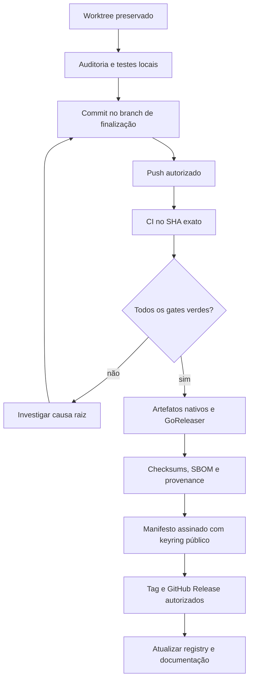

# IAPro Nexus — playbook de publicação Community Preview

Este documento descreve uma publicação reproduzível. Ele separa o que pode ser
feito no repositório do que exige acesso administrativo, secrets ou credenciais
de assinatura.

## Alvo canônico

O alvo planejado é:

```text
organização: IAPro-Community
repositório: nexus
binário: nexus
alias de compatibilidade: ai
```

Até que o repositório seja criado ou transferido, URLs de download continuam
apontando para o repositório histórico. Não publique links para um destino que
retorna 404.

## Fluxo de promoção



## Gates obrigatórios no mesmo SHA

### Produto e qualidade

- Frontend: frozen install, format, TypeScript, ESLint, Stylelint, unit,
  build, embed-sync, Playwright, Axe e visual.
- Go: `gofmt`, `go vet`, golangci-lint, testes, race e segurança.
- Linux, Windows e macOS: testes nativos quando o comportamento depende do SO.
- Desktop: Core Ready, WebView carregado, sessão autenticada, REST, WebSocket,
  navegação básica e shutdown limpo.

### Artefatos

- CLI para cada combinação realmente verificada de SO/arquitetura.
- NSIS, DMG/app e DEB/RPM somente quando os runners nativos confirmarem os
  pacotes.
- `checksums.txt`, SBOM e provenance para os artefatos publicados.
- Manifesto com `component`, `os`, `arch`, `format`, `installationMethod`, URL,
  SHA-256, tamanho, versão e canal.

### Trust chain

1. Gerar o manifesto em CI.
2. Assinar com uma chave Ed25519 mantida em secret de ambiente protegido.
3. Publicar a chave pública e seu `key_id` no registry confiável.
4. Testar chave atual, futura, revogada e desconhecida.
5. Rejeitar checksum incorreto, SO/arquitetura errados, downgrade e manifesto
   expirado.

Sem o passo 3, a release pode ser preparada, mas não deve ser descrita como
uma cadeia de supply chain assinada.

## Secrets e permissões

| Item | Onde fica | Motivo |
| --- | --- | --- |
| `NEXUS_UPDATE_PRIVATE_KEY` | GitHub Environment protegido | Assinar manifestos |
| `NEXUS_UPDATE_KEY_ID` | GitHub Environment | Selecionar chave pública |
| `NEXUS_UPDATE_PUBLIC_KEY` | GitHub Environment variable, não secreta | Trust root Ed25519 embutido nos builds |
| Authenticode | Secret/certificado externo | Assinar Windows |
| Apple Developer ID/notarization | Secrets macOS | Assinar/notarizar Apple |
| `contents: write` | Apenas workflow de release | Criar publicação |
| `id-token: write` | Apenas provenance | Attestation OIDC |

Nunca coloque private key, token ou certificado no Git, README, issue ou log.
O workflow de release deve falhar fechado quando `NEXUS_UPDATE_PUBLIC_KEY` não
estiver configurada ou não corresponder à chave privada de assinatura.

## Componentes e version skew

Uma release Nexus pode fornecer `CLI`, `DESKTOP` ou `BUNDLE`. O instalador deve
informar o componente instalado e impedir que um CLI e um Desktop incompatíveis
escrevam no mesmo estado durável sem uma política explícita de schema/version
guard.

Instalações administradas por APT, DNF/RPM, Homebrew, Winget, Store ou MSIX
devem ser atualizadas pelo gerenciador correspondente; o updater Nexus não
substitui seus arquivos diretamente.

## Checklist antes da publicação

- [ ] Repositório `IAPro-Community/nexus` existe e a equipe tem permissão.
- [ ] O branch de finalização foi revisado e o SHA está anotado.
- [ ] O CI obrigatório do mesmo SHA está verde.
- [ ] Runners Windows e macOS produziram evidência nativa, não só cross-build.
- [ ] Keyring público está publicado e a rotação foi testada.
- [ ] Pacotes foram instalados em ambientes limpos.
- [ ] README, suporte, segurança, changelog e matriz não exageram claims.
- [ ] Tag/release recebeu autorização humana explícita.

## Rollback

Rollback de release não apaga artefatos já distribuídos. Marque a versão como
revogada no registry, interrompa o rollout, mantenha o artefato para auditoria
e publique uma versão corrigida com novo manifesto e checksum. Em instalação
local, o updater só retorna à versão anterior se sua integridade e sua política
de downgrade permitirem.
