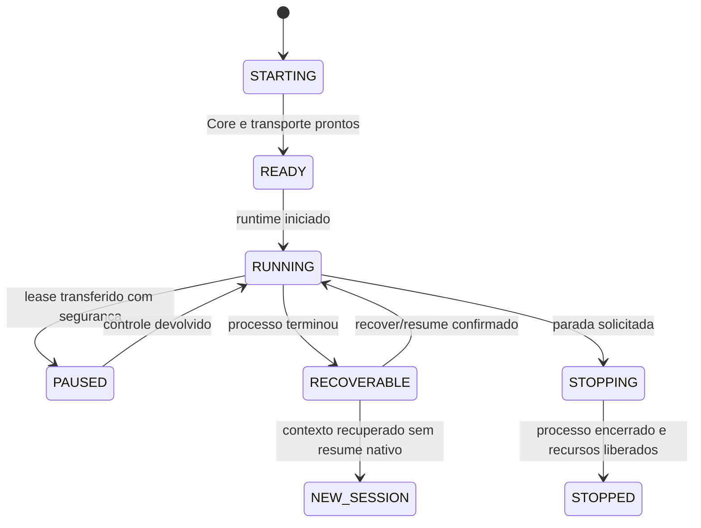
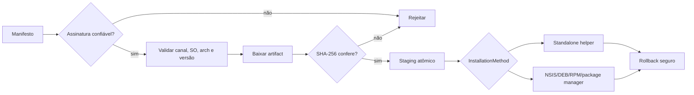

# IAPro Nexus — visão técnica

## Contrato arquitetural

O Nexus mantém uma única linha de produto:

```text
React frontend
      │
      ├── Browser WebBridge ──┐
      └── Wails DesktopBridge ┘
                   │
             REST + WebSocket
                   │
              Nexus Core
       ┌───────────┼───────────┐
       │           │           │
  Control API   Runtime     Durable Store
       │           │
   SessionHost  PTY/ConPTY
```

## Responsabilidades

| Camada | Responsabilidade | Não deve fazer |
| --- | --- | --- |
| React | Apresentação, navegação, acessibilidade e interação | Executar provider, alterar SQLite ou inventar estado |
| NexusClient | REST/WebSocket e normalização de contratos | Conhecer detalhes do Wails |
| PlatformBridge | Picker, tema, notificações, lifecycle e links nativos | Implementar domínio, scheduler ou update |
| Control API | Autenticação, autorização, sessões, eventos e comandos | Expor atalho privilegiado sem contrato |
| Core | Agentes, runtime, providers, quotas, scheduler e workspaces | Duplicar lógica no Desktop |
| SessionHost | Lease de escrita, PTY/ConPTY, output e lifecycle | Criar transporte alternativo por plataforma |
| Update Service | Manifesto, keyring, versão, canal, checksum, staging e rollback | Atualizar Maestro implicitamente |

## Identidade de filesystem

Paths têm três representações diferentes:

```text
PathRef
├── DisplayPath        representação adequada para a pessoa
├── CanonicalPath      forma normalizada para operações
└── FilesystemIdentity identidade usada para equivalência
```

Isso permite tratar `/var` e `/private/var`, ou caminhos Windows com case e
formato 8.3, como a mesma localização quando o filesystem confirma a
equivalência, sem substituir desnecessariamente o caminho que a pessoa escolheu
ver.

## Estado e segurança



Invariantes importantes:

- loopback e sessão autenticada por padrão;
- origem, CSRF, WebSocket e TTL verificados no Control API;
- tokens de bootstrap não são persistidos nem logados;
- links externos aceitam somente schemes allowlisted;
- artefatos de atualização precisam passar por manifesto confiável e SHA-256;
- credenciais são isoladas por plataforma e por perfil;
- um autonomous writer não compartilha worktree com outro writer.

## Ciclo de atualização



O fluxo só pode ser chamado de “assinado” quando a chave pública do ambiente
de distribuição estiver publicada, versionada e testada. Enquanto isso, a
documentação deve chamar o fluxo de checksum-only e manter o status como
incompleto para Community Preview.

## Evidência de plataforma

Cross-compilation prova que o código compila para outro alvo; não prova
ConPTY, Named Pipe, WebView2, WKWebView, PTY, keyring, installer ou smoke de
Desktop. A matriz pública mantém essas categorias separadas e exige runner
nativo para elevar um alvo a `VERIFIED`.

Consulte a [matriz de suporte](../platform/PLATFORM_SUPPORT_MATRIX.md), os ADRs
em [`docs/architecture`](../architecture/) e o relatório de validação em
[`DEV/validation`](../../DEV/validation/).

