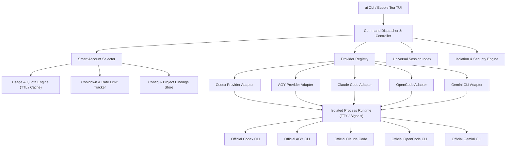
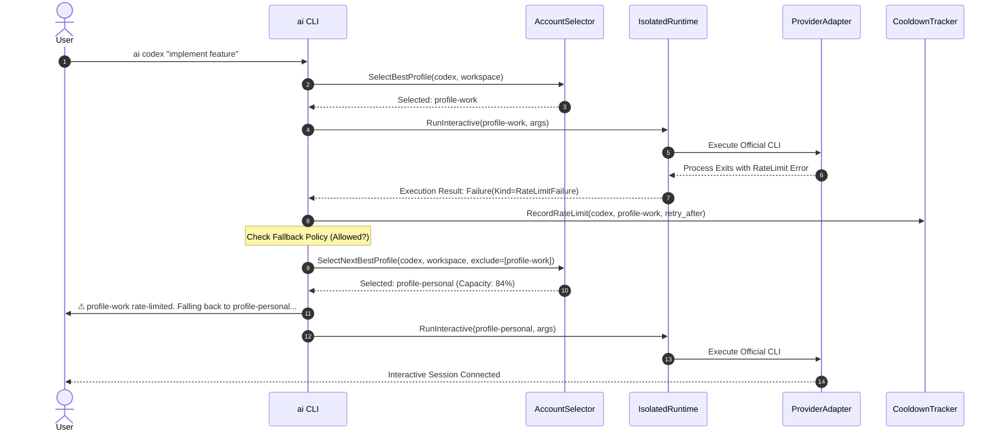

# Design Document: AI CLI Control Plane

## 1. Goals & Non-Goals

### Goals
- **Local Control Plane**: Provide a single, unified entry point and control plane (`ai`) for developer AI coding CLIs (Codex, AGY / Antigravity, Claude Code, OpenCode, Gemini CLI) while maintaining the official CLI as the source of truth for authentication.
- **Reliable Quota Engine**: Eliminate fabricated 100% quota assumptions. Use a cascading probe strategy with explicit usage states (`LIVE`, `CACHED`, `ESTIMATED`, `UNKNOWN`, `UNSUPPORTED`, `RATE_LIMITED`, `ERROR`), freshness timestamps, and TTL-aware caching.
- **Smart Account Selection & Scheduling**: Select the healthiest, highest-capacity available account automatically when running commands (e.g., `ai codex` or `ai claude`) based on a deterministic scoring function, hard filters, project bindings, and sticky affinities.
- **Automatic Fallback & Cooldown**: Classify CLI errors into structured categories (`QuotaFailure`, `RateLimitFailure`, `AuthFailure`, etc.) and automatically fallback to next-best accounts for rate-limited/quota failures without infinite loops.
- **Session Continuity & Handoff**: Provide a universal session index across all providers, provider-specific session resumption (e.g. `codex resume <id>`, `claude --resume <id>`), and cross-account handoff where technically supported.
- **Security & Runtime Isolation**: Isolate credentials per profile without creating unvetted symlinks to machine-wide secrets (`~/.ssh`, `~/.git-credentials`, `~/.kube`, `~/.docker`). Implement configurable isolation presets (`strict`, `developer`, `compat`).
- **Professional TUI & Scriptable CLI**: Deliver a high-performance Bubble Tea interactive interface (mouse/keyboard, responsive layout, search, modal inspectors) alongside a scriptable CLI with structured `--json` output and standardized exit codes.

### Non-Goals
- **No Central OAuth Proxy / Token Router**: The tool will not store, decrypt, or proxy OAuth refresh tokens or passwords into a central database.
- **No Machine Sandbox Simulation**: Profile isolation isolates per-profile configurations, keyrings, and CLI state; it is not a virtualization/container hypervisor.
- **No Fabricated Data**: If quota or usage cannot be determined reliably, the system reports `UNKNOWN` and falls back to LRU/least-recently-used heuristics rather than guessing percentages.

---

## 2. Architecture Overview



---

## 3. Quota & Usage Domain Model

```go
type UsageStatus string

const (
    UsageLive        UsageStatus = "LIVE"
    UsageCached      UsageStatus = "CACHED"
    UsageEstimated   UsageStatus = "ESTIMATED"
    UsageUnknown     UsageStatus = "UNKNOWN"
    UsageUnsupported UsageStatus = "UNSUPPORTED"
    UsageRateLimited UsageStatus = "RATE_LIMITED"
    UsageError       UsageStatus = "ERROR"
)

type UsageSource string

const (
    SourceOfficialAPI    UsageSource = "OFFICIAL_API"
    SourceCLIOutput      UsageSource = "CLI_OUTPUT"
    SourceLocalFiles     UsageSource = "LOCAL_FILES"
    SourceResponseHeader UsageSource = "RESPONSE_HEADERS"
    SourceObservation    UsageSource = "OBSERVATION"
    SourceNone           UsageSource = "NONE"
)

type UsageWindow struct {
    Kind             string     `json:"kind"` // "5h", "weekly", "daily", "monthly"
    UsedPercent      *float64   `json:"used_percent,omitempty"`
    RemainingPercent *float64   `json:"remaining_percent,omitempty"`
    ResetTime        *time.Time `json:"reset_time,omitempty"`
    ResetDescription string     `json:"reset_description,omitempty"`
}

type UsageSnapshot struct {
    ProviderID string        `json:"provider_id"`
    ProfileID  string        `json:"profile_id"`
    Status     UsageStatus   `json:"status"`
    Source     UsageSource   `json:"source"`
    FetchedAt  time.Time     `json:"fetched_at"`
    ExpiresAt  *time.Time    `json:"expires_at,omitempty"`
    Windows    []UsageWindow `json:"windows"`
    Error      string        `json:"error,omitempty"`
}
```

---

## 4. Smart Account Selector Algorithm

```text
Score(Profile P) =
    AvailabilityScore(P)
  + QuotaScore(P)
  + ResetProximityScore(P)
  + RecentSuccessScore(P)
  + ProjectBindingBonus(P)
  + PriorityWeight(P)
  - ErrorPenalty(P)
  - RateLimitPenalty(P)
  - RecentUsagePenalty(P)
```

### Hard Filters:
1. Provider installed and functional (`binary present`).
2. Profile exists, valid, and enabled (`!p.Disabled`).
3. Profile is authenticated (`p.Authenticated == true`).
4. Not currently in active cooldown (`CooldownTracker.IsActive(provider, profile) == false`).

### Unknown Quota Resolution:
When exact percentages are `UNKNOWN`:
1. Healthy accounts without rate limits are filtered.
2. Least-Recently-Used (LRU) or round-robin rotation distributes load evenly.
3. UI clearly displays `UNKNOWN · HEALTHY`, never arbitrary progress bars.

---

## 5. Automatic Fallback Execution Flow



---

## 6. Security Model & Isolation Presets

| Preset | Shared Paths / Envs | Denied / Isolated Paths | Target Use Case |
|---|---|---|---|
| `strict` | Git user name/email config (read-only), `SSH_AUTH_SOCK` | `~/.ssh/*`, `~/.git-credentials`, `~/.gnupg`, `~/.kube`, `~/.docker`, `~/.npmrc` | Hardened environments, untrusted models |
| `developer` *(default)* | `.gitconfig`, `SSH_AUTH_SOCK`, `.npmrc` (read-only), development config directories | `~/.ssh` private key files, `.git-credentials`, `.kube`, `.docker` | Standard software development workflow |
| `compat` | Host dotfiles (`.gitconfig`, `.ssh`, `.npmrc`, `.bashrc`) | Isolated profile keyrings & OAuth storage | Maximum backward compatibility |

---

## 7. Universal Session Model

```go
type Session struct {
    ProviderID      string    `json:"provider_id"`
    ProfileID       string    `json:"profile_id"`
    ID              string    `json:"id"`
    Title           string    `json:"title"`
    Workspace       string    `json:"workspace"`
    CreatedAt       time.Time `json:"created_at"`
    UpdatedAt       time.Time `json:"updated_at"`
    ResumeSupported bool      `json:"resume_supported"`
    Pinned          bool      `json:"pinned"`
}
```

---

## 8. Provider Capabilities Matrix

| Capability | Codex | AGY | Claude Code | OpenCode | Gemini CLI |
|---|---|---|---|---|---|
| `Login` | `yes` | `yes` | `yes` | `yes` | `yes` |
| `Logout` | `yes` | `yes` | `yes` | `yes` | `yes` |
| `Usage` | `yes` | `yes` | `yes` | `yes` | `yes` |
| `Conversations` | `yes` | `yes` | `yes` | `yes` | `yes` |
| `Resume` | `yes` (`codex resume <id>`) | `yes` (`agy --conversation=<id>`) | `yes` (`claude --resume <id>`) | `yes` (`opencode -s <id>`) | `yes` (`gemini -r <id>`) |
| `CrossAccountResume` | `yes` (shared workspace sessions) | `yes` (shared .gemini brain) | `no` | `yes` | `no` |
| `HotAccountSwitch` | `no` | `no` | `no` | `no` | `no` |
| `IsolatedRuntime` | `yes` (`CODEX_HOME`) | `yes` (D-Bus keyring / HOME) | `yes` (Isolated `HOME`/`CLAUDE_CONFIG_DIR`) | `yes` (Isolated `XDG_DATA`/`HOME`) | `yes` (Isolated `GEMINI_HOME`/`XDG`) |
| `ProjectBinding` | `yes` | `yes` | `yes` | `yes` | `yes` |

---

## 9. Standardized Exit Codes

- `0`: Success
- `10`: Provider not found (binary not installed in PATH)
- `11`: Provider unavailable / unhealthy
- `20`: Profile not found
- `21`: Profile unavailable / disabled
- `30`: Authentication required
- `40`: Usage unknown
- `41`: Rate limited (all accounts exhausted or explicit account rate-limited)
- `42`: Quota exhausted
- `50`: Conversation / Session not found
- `51`: Session resume unsupported
- `60`: Runtime execution error
- `70`: Invalid configuration
