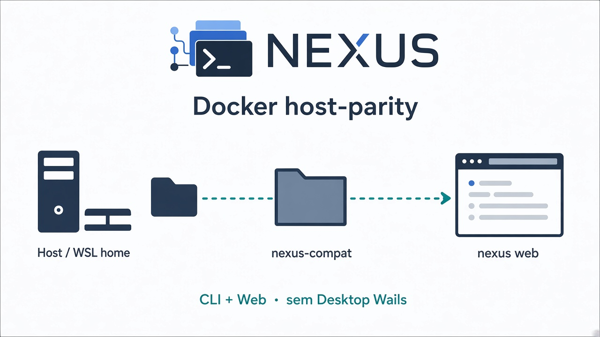

# Docker — camada de compatibilidade (host-parity)



Documento **somente Docker**. Instalação nativa: [installation.md](installation.md). Pacotes: [packages.md](packages.md). Decisão: [ADR](../architecture/ADR-docker-compat-host-parity.md).

Docker é **aditivo**: CLI Linux + Web no browser. **Não** substitui Desktop Windows (`install.ps1` / NSIS / Wails).

## O que entra / o que fica de fora

| Incluído | Não incluído |
| --- | --- |
| `nexus` (CLI Linux) | `nexus-desktop` / Wails |
| `nexus web` em `127.0.0.1` | ConPTY, WebView2, tray nativo |
| Bins de providers **sem** login (opcional na imagem) | Tokens, OAuth ou licenças na imagem |
| Homes de profile no disco do host (same-path) | Update via NSIS/winget |

Arquivo Compose padrão: [`docker-compose.yaml`](../../docker-compose.yaml) (`compose.yaml` é alias idêntico).

## Modelo de confiança

Leia antes de ligar o Compose.

`host-parity` monta a **home inteira** e o workspace nos **mesmos caminhos absolutos** (RW), no espírito do terminal como extensão do host (ex.: vpn-dev-workspace).

- Raio de impacto = dar um shell com o seu usuário Linux/WSL.
- Exija `I_ACCEPT_HOST_PARITY=1` no `.env`.
- `isolation_preset` do Nexus isola o **launch** dos providers (`CLAUDE_CONFIG_DIR`, `CODEX_HOME`, …). **Não** impede que outros processos no container leiam o restante da home montada.
- Agente SSH **desligado** por padrão (`ENABLE_SSH_AGENT=0`). Com `1`, o container pode assinar via agente.

Nunca monte `docker.sock`. Bind da Web só em `127.0.0.1`.

## Homes de licença / histórico

Com launch pelo Nexus, dados ficam em:

```text
~/.local/share/ai-manager/profiles/<provider>/<profile>/home/
```

| Provider | Onde fica auth / histórico |
| --- | --- |
| Claude | `.../home/.claude`, `.../home/.claude.json` |
| Gemini | `.../home/.gemini` |
| Codex | `.../home` e `.../home/.codex` |
| OpenCode | `.../home` com dirs XDG / `OPENCODE_CONFIG_DIR` |

Same-path host↔container: login e histórico funcionam nativo e no Docker.

**Windows:** use a home **Linux do WSL** em `HOST_HOME_DIR`. CLI só em `C:\Users\...` **não** aparece no container (FAIL esperado até instalar no WSL).

## Início rápido

```bash
cp .env.example .env
# edite: I_ACCEPT_HOST_PARITY=1, HOST_UID, HOST_GID, WORKSPACE_DIR
docker compose -f docker-compose.yaml up --build
docker compose -f docker-compose.yaml exec nexus nexus doctor --json
```

Abra a URL de bootstrap do `nexus web` (porta `NEXUS_WEB_PORT`, padrão `7420`).

Variáveis: ver [`.env.example`](../../.env.example).

## CLIs na imagem

Com `WITH_PROVIDER_CLIS=1` (padrão), a imagem pode instalar pacotes públicos de CLI **sem credenciais**. Bins do host no PATH montado têm prioridade.

- Doctor pode mostrar provider `installed` e ainda não autenticado até o login na home do profile.
- Redistribuir CLIs de terceiros é best-effort; se o pacote npm mudar de nome, o caminho suportado continua sendo host-parity.

## CLI ainda sem adapter no Nexus

1. Instale o CLI no host (ou WSL) no PATH da home montada.
2. Opcional — isolar estado:

```bash
mkdir -p "$HOME/.local/share/ai-manager/profiles/custom/meu-cli/home"
HOME="$HOME/.local/share/ai-manager/profiles/custom/meu-cli/home" meu-cli
```

3. Use no workspace. Não entra na UI de providers até existir adapter ([provider-development.md](../provider-development.md)).

## Checklist

- [ ] `I_ACCEPT_HOST_PARITY=1`
- [ ] `HOST_HOME_DIR` = home do usuário (WSL no Docker Desktop Windows)
- [ ] `which claude|gemini|codex` conforme esperado (host ou imagem)
- [ ] `nexus doctor --json` → `runtime.container` PASS; Desktop/WebView2/ConPTY SKIPPED/N/A
- [ ] Web em `127.0.0.1` com bootstrap
- [ ] Sem `docker.sock` no Compose

## Ver também

- [ADR-docker-compat-host-parity](../architecture/ADR-docker-compat-host-parity.md)
- [Instalação nativa](installation.md)
- [Pacotes](packages.md)
- [Segurança / isolation_preset](../security.md)
