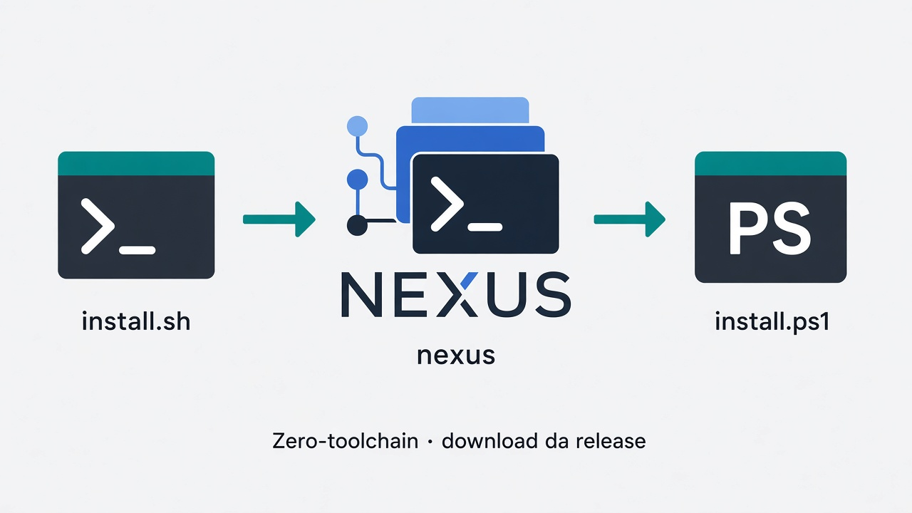

# Instalação nativa (zero-toolchain)



Instale o Nexus no **host** via scripts de release. Este documento **não** cobre Docker nem pacotes DEB/RPM/NSIS — veja os guias separados.

| Quero… | Documento |
| --- | --- |
| DEB / RPM / NSIS / winget | [Pacotes nativos](packages.md) |
| Rodar no Docker (CLI + Web) | [Docker compatibilidade](docker-compat.md) |
| Índice getting-started | [README](README.md) |

## Caminho recomendado

Binário de release. **Não** exige Go, Bun nem Node.

| Caminho | Pré-requisitos |
| --- | --- |
| Release CLI | `curl` ou `wget`, `tar`, `sha256sum`/`shasum` (Unix) ou PowerShell (Windows) |
| Desktop nativo (opcional) | WebView2 (Windows) ou WebKitGTK (Linux) |
| Maestro (opt-in) | Node.js + npm (`--with-maestro` / `-WithMaestro`) |
| Compilar do fonte | Go 1.25+, Bun 1.3.9+, make, git |

### Linux / macOS

```bash
curl -fsSL https://raw.githubusercontent.com/kivervinicius/ai-cli/main/install.sh | bash -s -- --version=latest
nexus doctor
nexus web
```

Versão pinada:

```bash
bash install.sh --version=v0.5.0-beta.23
```

Flags: `--no-desktop`, `--no-path`, `--with-maestro`, `--build-from-source`, `--yes`, `NEXUS_RELEASE_REPO=owner/repo`.

### Windows (PowerShell)

```powershell
irm https://raw.githubusercontent.com/kivervinicius/ai-cli/main/install.ps1 -OutFile install.ps1
.\install.ps1 -Version latest
nexus doctor
nexus web
```

Flags: `-NoDesktop`, `-WithMaestro`, `-BuildFromSource`, `$env:NEXUS_RELEASE_REPO='owner/repo'`.

Instalador gráfico (quando publicado na release): ver [Pacotes nativos — NSIS](packages.md#windows-nsis).

## Integridade de `--version=latest`

O instalador resolve a tag mais recente pela API do GitHub e valida o SHA-256 em `checksums.txt` (**integridade**). Não trate como cadeia de suprimentos assinada enquanto a chave pública e o manifesto Ed25519 não estiverem no fluxo do instalador.

## Compilar do fonte (desenvolvedores)

```bash
git clone https://github.com/kivervinicius/ai-cli.git
cd ai-cli
bun --cwd web install --frozen-lockfile
make build
./nexus version
./nexus doctor
```

Alternativa: `./install.sh --build-from-source [--yes]` ou `.\install.ps1 -BuildFromSource`.

O build produz `./nexus` no checkout. `make install-local` copia o binário para o prefixo local.

## Executar a Web

```bash
nexus web --no-open
```

Abra a URL `Bootstrap` no terminal. Loopback por padrão. Não compartilhe tokens, cookies ou credenciais em issues ou logs.

## Diagnóstico

```bash
nexus doctor --json
```

No Docker, probes de Desktop/WebView2/ConPTY aparecem como N/A — detalhes em [docker-compat.md](docker-compat.md).

## Próximo passo

[Primeiro projeto](first-project.md)
