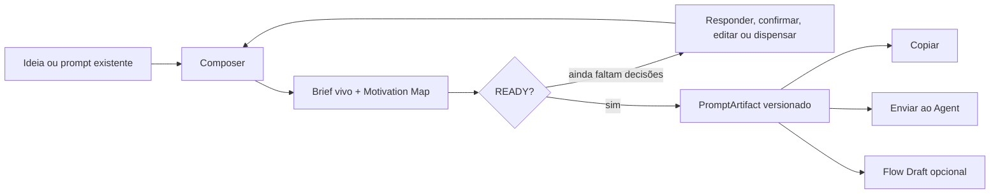
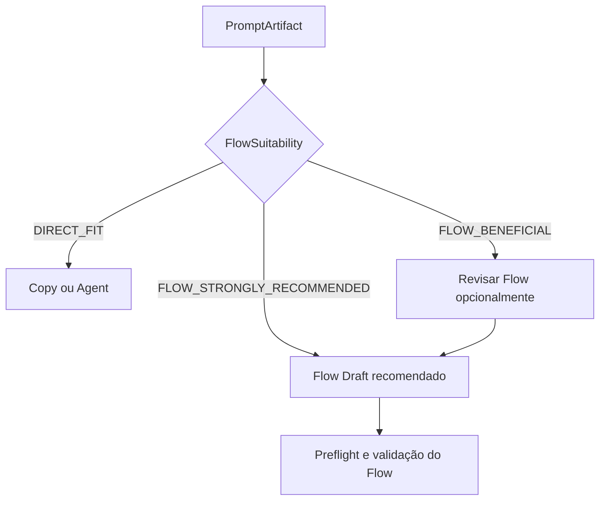

# Guia prático do Nexus Composer

Este guia é a forma curta de usar o Composer para transformar uma intenção em
um prompt verificável. O Flow é opcional: use-o apenas quando houver benefício
objetivo de paralelismo, dependências, múltiplos agentes, gates, recuperação ou
isolamento.

## Visão rápida



O Composer não considera uma frase do agente como prova de conclusão. A
entrega precisa de critérios, testes, verificação e evidências reais.

## 1. Começar

No workspace, abra Composer e escolha uma das entradas:

- **Ideia / Explorar** — para uma intenção ainda vaga;
- **Prompt Existente** — para revisar lacunas, contradições e estrutura;
- **Projeto atual** — quando o contexto do repositório é parte da decisão.

Descreva o resultado desejado em uma frase. Exemplos:

```text
Adicionar recuperação de senha com token expirável, e-mail mockado e testes.
```

```text
Melhore este prompt para implementar uma API segura sem ampliar o escopo.
```

## 2. Responder uma decisão por rodada

O Composer mantém um brief vivo e pergunta a próxima decisão de maior impacto.
Você pode:

- responder normalmente;
- confirmar uma inferência;
- editar uma sugestão;
- dispensar uma pergunta que não se aplica;
- continuar aprofundando;
- parar e aceitar explicitamente lacunas visíveis.

As informações são diferenciadas por origem: `USER`, contexto do projeto,
`INFERRED`, `ASSUMED` ou `DISMISSED`. Uma inferência nunca deve parecer um fato
confirmado.

## 3. Ler o briefing

Antes de finalizar, confira:

1. objetivo e resultado observável;
2. Motivation Map: problema → resultado → requisito → aceite → evidência;
3. escopo e fora de escopo;
4. restrições, riscos e ações proibidas;
5. testes e verificação;
6. skills sugeridas, origem, versão e disponibilidade;
7. gaps do prompt existente, quando aplicável.

Quando o Maestro estiver indisponível, o estado correto é `MAESTRO_DEGRADED`.
Nesse caso o Composer não inventa skills ou recomendações.

## 4. Finalizar e escolher um destino

Ao finalizar, o Nexus cria um `PromptArtifact` imutável com hash e revisão.
Existem três variantes rastreáveis:

| Destino | Uso | Flow necessário? |
| --- | --- | --- |
| Copy | levar o prompt a qualquer ferramenta | não |
| Send to Agent | executar em um Agent do Nexus | não |
| Turn into Flow | criar um rascunho visual com lineage | somente se fizer sentido |

**Copy** não instala skills externas. O manifesto informa origem e portabilidade.

**Send to Agent** valida skills no Agent/provider escolhido e respeita as
políticas existentes.

**Turn into Flow** cria apenas um draft. Não inicia Agent, MissionRun ou runtime.
O handoff conserva sessão, revisão, artifact ID, hash, brief, Motivation Map,
skills, critérios, restrições, riscos e contexto.

## 5. Quando usar o Flow

O Composer mostra uma recomendação explicável. O Flow é especialmente útil
quando há duas ou mais frentes paralelas, dependências entre entregas, revisão
independente, gates, risco alto ou execução longa/retomável. Para uma tarefa
simples e direta, copiar ou enviar ao Agent é o caminho mais curto.



## 6. Retomar uma sessão

Sessões são persistidas. Reabra o workspace, escolha a sessão salva e confira
a revisão antes de continuar. Se uma mutação estiver desatualizada, o Nexus
retorna conflito de revisão em vez de sobrescrever uma resposta mais nova.

## 7. Roteiro de demonstração em vídeo

Para gravar uma demonstração de 3–5 minutos:

1. mostrar o workspace e abrir Composer;
2. inserir a ideia de recuperação de senha;
3. responder apenas a pergunta mais importante de cada rodada;
4. mostrar Motivation Map, readiness e skills com origem;
5. finalizar e abrir a variante portátil;
6. copiar o prompt sem abrir Flow;
7. repetir com uma tarefa com backend/frontend/review;
8. mostrar `FlowSuitability` e criar Flow Draft;
9. reabrir a sessão e mostrar a mesma revisão/hash;
10. terminar exibindo o handoff e o estado persistido.

Não simule execução, progresso ou sucesso no vídeo. Se um provider/Maestro não
estiver disponível, mostre `MAESTRO_DEGRADED` e explique a limitação.

## 8. Checklist de confiança

Antes de entregar um prompt a um Agent, confirme:

- [ ] objetivo é observável;
- [ ] motivação e resultado estão claros;
- [ ] escopo e fora de escopo estão explícitos;
- [ ] toda entrega possui aceite e verificação;
- [ ] inferências foram confirmadas ou mantidas como premissas;
- [ ] skills têm fonte, versão e disponibilidade;
- [ ] o destino escolhido é intencional;
- [ ] a revisão/hash do artifact foi preservada.

Para o passo a passo do canvas e do handoff, consulte também o [Guia do Flow](nexus-flow-user-guide.md).

Para diagnóstico técnico e evidências de implementação, consulte
[`docs/nexus-composer-validation.md`](nexus-composer-validation.md) e
[`DEV/SPECS/COMPOSER_FLOW_IMPLEMENTATION.md`](../DEV/SPECS/COMPOSER_FLOW_IMPLEMENTATION.md).
