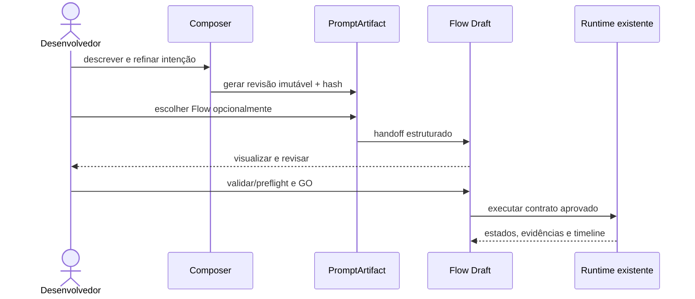
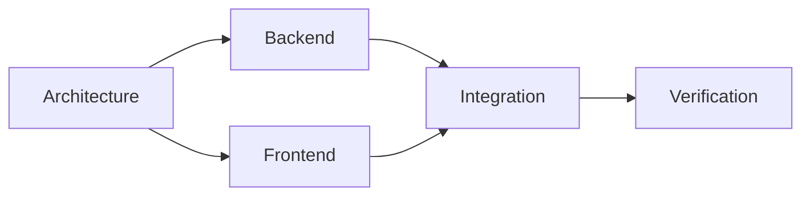
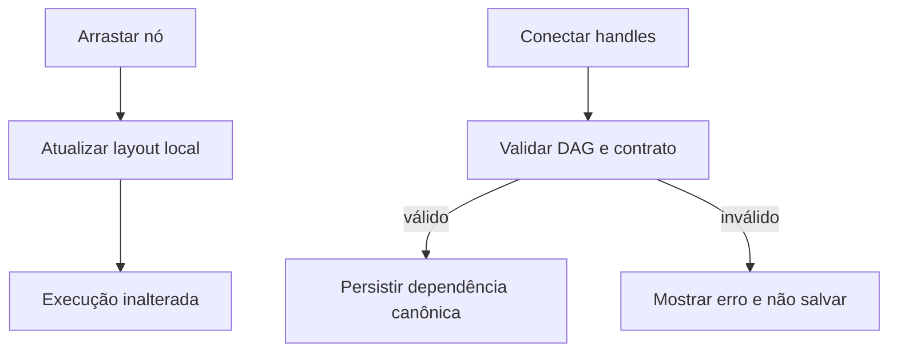
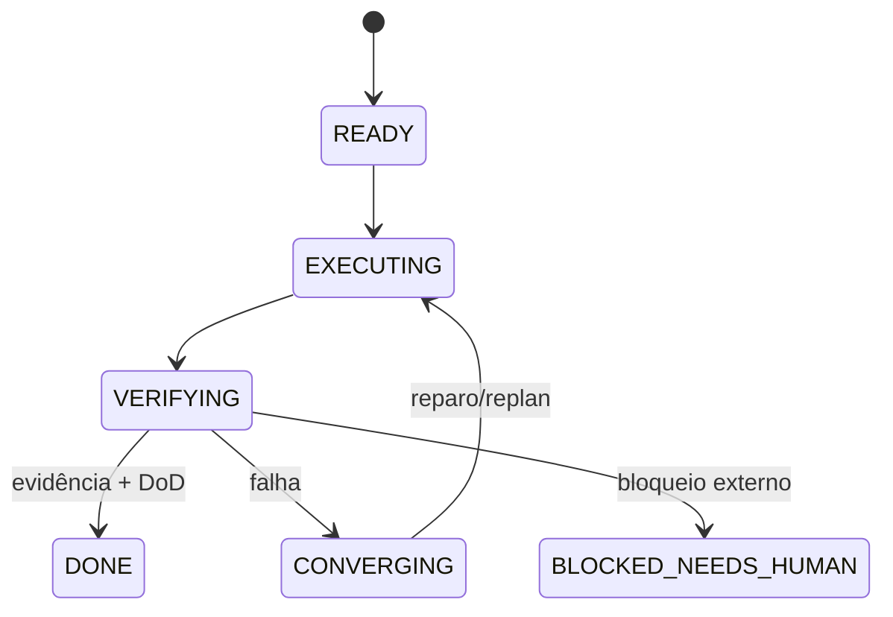
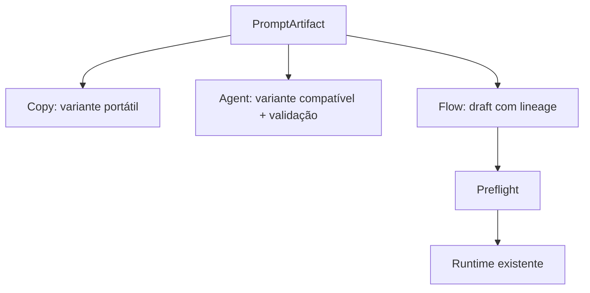

# Guia prático do Nexus Flow e integração com o Composer

O Flow é o painel visual para inspecionar, ajustar e acompanhar uma execução
estruturada. Ele não é um segundo Composer, nem uma fonte paralela de verdade:
o WorkPlan/contrato de execução continua sendo a autoridade operacional.

## A conexão completa

O handoff preserva `composer_session`, revisão, `PromptArtifact ID`, hash,
brief, Motivation Map, skills e procedência, critérios de aceite, restrições,
riscos, contexto e fingerprints. Criar um Flow Draft não inicia Agent,
MissionRun ou runtime.

## Quando abrir o Flow

O Composer mostra `FlowSuitability` com razões concretas. Abra o Flow quando a
visualização trouxer valor para:

- duas ou mais frentes paralelas;
- dependências entre entregas;
- múltiplas especialidades ou agentes;
- execução longa e retomável;
- gates, revisão independente ou risco elevado;
- isolamento de workspace/worktree;
- acompanhamento de evidências e recuperação.

Para uma tarefa simples, o caminho recomendado continua sendo Copy ou Send to
Agent. O usuário nunca precisa abrir o Flow para obter um prompt ou executar
diretamente.

## O que aparece no canvas

O canvas usa React Flow para pan, zoom, seleção, minimap, controles, nós e
arestas. O mapeamento é:

| Elemento visual | Contrato operacional |
| --- | --- |
| nó | task/step do Flow |
| aresta | dependência (`source → target`) |
| estado do nó | estado real recebido do runtime |
| agente | assignment do plano |
| artifact | entrada/saída versionada |
| gate | preflight/verificação/approval do contrato |

## Layout não é dependência

Arrastar um nó muda apenas a posição visual. Isso não muda a ordem de execução
nem cria dependência. Arestas representam semântica de execução.

Para alterar o fluxo, conecte dois handles válidos. A mudança deve passar pela
validação do contrato canônico, que rejeita referências inexistentes e ciclos.
Se uma alteração for inválida, corrija a topologia antes de salvar; o runtime
nunca deve receber um grafo inválido.

## Modo de revisão

Antes do GO, use o Flow para:

1. conferir tasks, dependências e ondas de paralelismo;
2. selecionar agente, role ou pool quando o contrato permitir;
3. conferir gates, DoD, artifacts e verificações;
4. executar preflight;
5. salvar a revisão do plano;
6. dar GO somente depois da validação.

O Flow deve respeitar um override explícito do usuário. Uma escolha `AUTO`
continua delegada à política do Maestro/Nexus; uma escolha fixa não pode ser
substituída silenciosamente.

## Modo de execução

Durante a execução, o Flow é um monitor operacional. O nó deve permitir
identificar rapidamente:

- estado atual;
- agente e provider;
- tentativa;
- dependências bloqueadoras;
- DoD já comprovada e ainda faltante;
- artifacts produzidos;
- verificações e falhas anteriores;
- reparos, handoffs, replans e duração.

Estados do nó são observações do backend, não animações artificiais. Uma
mensagem do agente dizendo “concluído” inicia verificação; ela não autoriza
`DONE` sozinha.

## Como voltar ao Composer

Se o plano revelar uma lacuna de intenção, escopo ou motivação, não force uma
correção improvisada no canvas. Retorne ao Composer, refine a sessão, gere uma
nova revisão do PromptArtifact e materialize novamente um draft. A linhagem
permite comparar revisão/hash e identificar qual brief originou o Flow.

## Como diagnosticar

1. **Flow vazio ou inválido:** confirme se o artifact existe e se o handoff
   retornou erro de validação; não crie nós manualmente fora do contrato.
2. **Aresta recusada:** procure ciclo, task inexistente ou dependência duplicada.
3. **Agente diferente do esperado:** confira assignment, disponibilidade e
   policy de fallback; `PINNED` indisponível deve aparecer como conflito.
4. **Task verde sem evidência:** trate como falha de verificação e não como
   conclusão.
5. **Flow após reload diferente:** recarregue do backend e confira a revisão,
   não o estado visual local.

## Roteiro visual para vídeo

Uma demonstração curta e honesta pode seguir este roteiro:

1. Composer: inserir uma feature full-stack;
2. mostrar readiness, Motivation Map e skills com procedência;
3. finalizar e exibir a recomendação de Flow;
4. criar Flow Draft;
5. mover cards para demonstrar que layout não altera dependências;
6. conectar Backend/Frontend a Integration e mostrar a validação;
7. salvar, recarregar e conferir a topologia;
8. dar GO após preflight;
9. acompanhar estados e evidências reais;
10. mostrar o hash e a linhagem do artifact na revisão final.

Não use `setTimeout`, progresso inventado ou status fixo para simular execução.
Quando um serviço estiver indisponível, mostre o bloqueio real.

## Relação com os três destinos do Composer

Copy, Agent e Flow são destinos equivalentes. Escolher Flow adiciona
visualização, dependências, paralelismo e recovery ao trabalho; não deve ser
uma barreira artificial para os outros destinos.

Consulte também o [Guia do Composer](nexus-composer-user-guide.md), a
 o [mapa público da documentação](README.md) e o
[relatório de validação](nexus-composer-validation.md).
