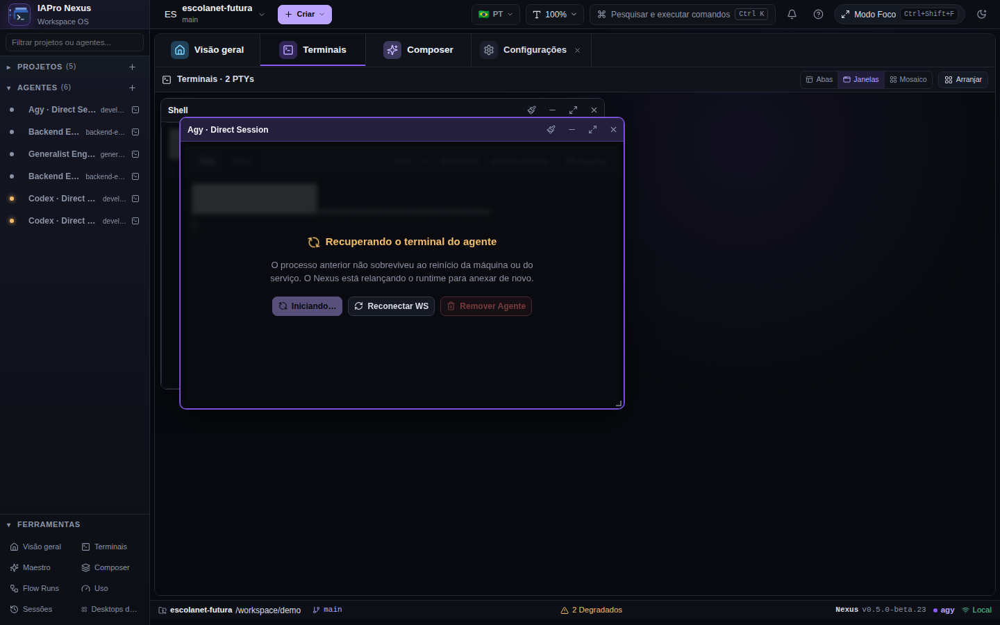
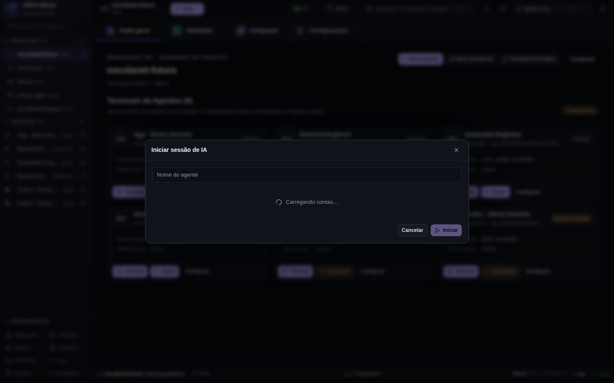
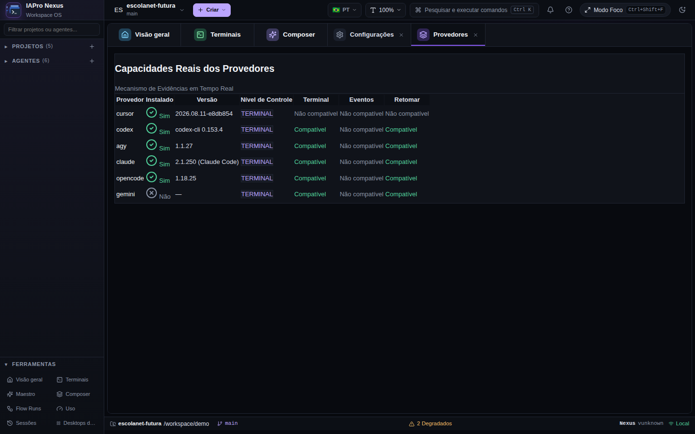
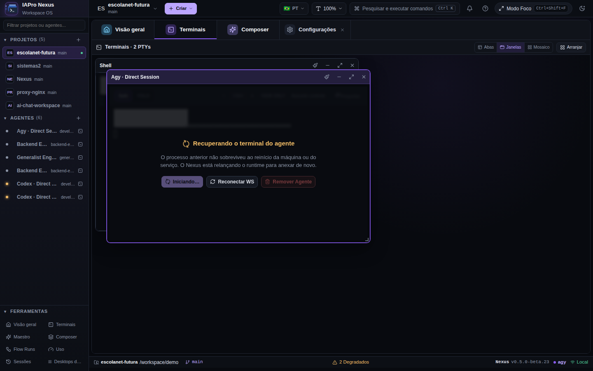
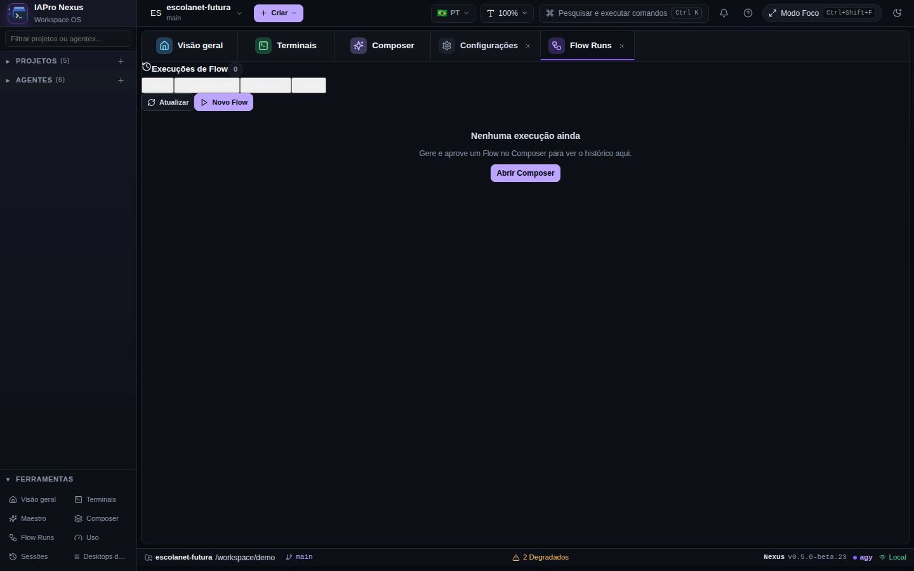
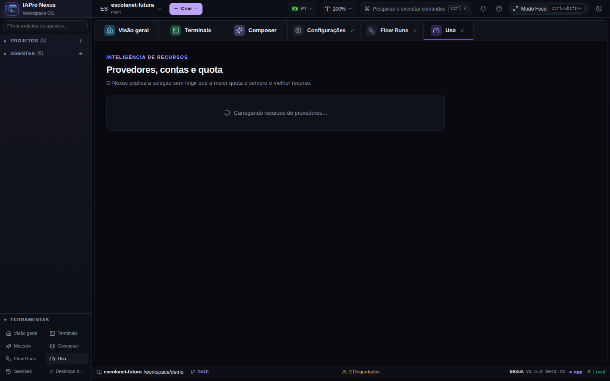
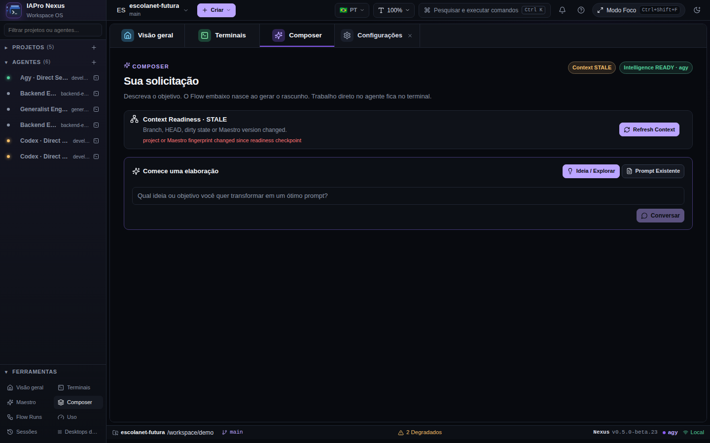
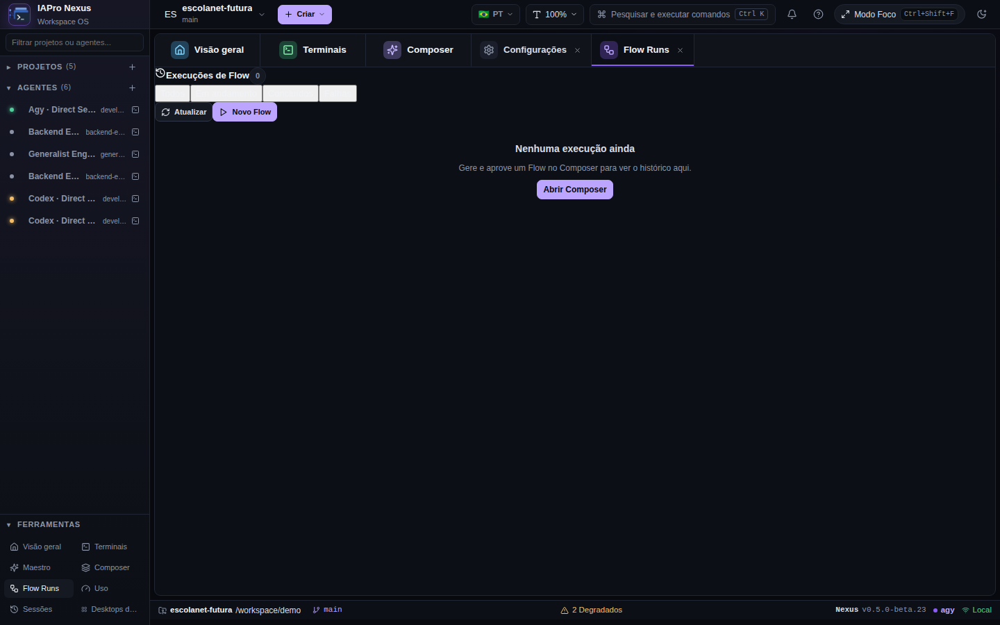
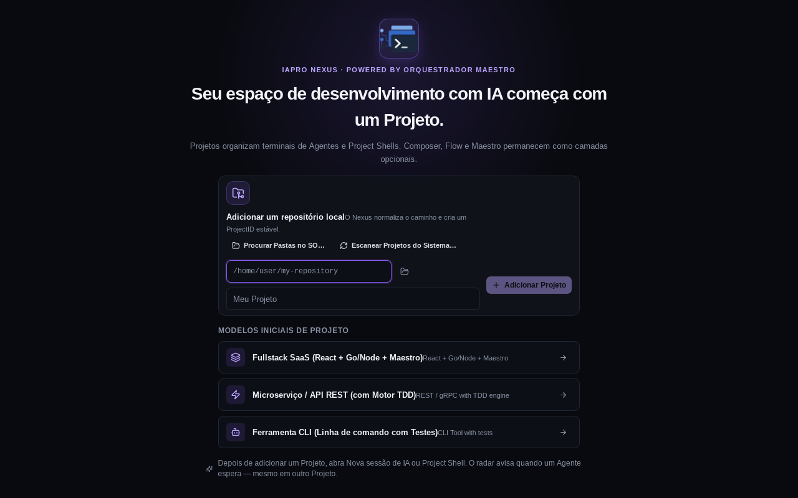

# Tour visual

As imagens abaixo devem ser capturas automatizadas do Nexus real. O manifesto
registra o commit, a superfície e o cenário de cada evidência.

1. **Workspace** — o ponto de entrada para projetos e superfícies persistentes.
   

2. **Projetos** — alternância de contexto e workspaces.
   

3. **Direct** — abertura de uma sessão sem exigir Composer ou Flow.
   

4. **Provider** — seleção e estado do provider usado pela sessão.
   

5. **Terminal** — terminal real com transporte supervisionado.
   

6. **Agentes** — runtimes, status e recuperação.
   

7. **Usage** — observabilidade de uso e quota sem prometer dados desconhecidos.
   

8. **Composer** — transformação de intenção em brief acionável.
   

9. **Flow** — revisão visual do plano antes da execução.
   

10. **Mission** — execução acompanhada de uma missão.
    

11. **Desktop** — a mesma aplicação em uma shell Wails nativa real.
    

[Baixar demonstração real do caminho Direct (WebM)](../assets/demos/direct-workflow.webm)

Quando novas superfícies forem capturadas, elas serão adicionadas aqui com
alt-text específico e uma referência ao manifesto. Mockups, diagramas e
imagens de marca não substituem captura do produto.
